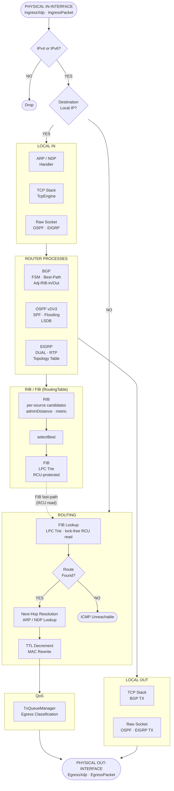

# VirtualRouter — Architecture Reference

This document covers the design and internal structure of VirtualRouter — a software
router written from scratch in C++17. It explains *why* things are built the way they
are, what principles guided the decisions, and how the major subsystems fit together.

---

## Table of Contents

- [Design Philosophy](#design-philosophy)
1. [Repository Layout](#1-repository-layout)
2. [High-Level Architecture](#2-high-level-architecture)
3. [Global Routing & VRF](#3-global-routing--vrf)
4. [RIB / FIB / RouteWatcher System](#4-rib--fib--routewatcher-system)
5. [BGP](#5-bgp)
6. [OSPF](#6-ospf)
7. [EIGRP](#7-eigrp)
8. [Async Control Plane — ProcessQueue & ControlScheduler](#8-async-control-plane--processqueue--controlscheduler)
9. [TimeManager](#9-timemanager)
10. [Configuration Registry](#10-configuration-registry)
11. [CLI Engine](#11-cli-engine)
12. [TCP Transport Layer](#12-tcp-transport-layer)
13. [Hardware — Ingress & Egress Pipelines](#13-hardware--ingress--egress-pipelines)
14. [Infrastructure — ARP & NDP](#14-infrastructure--arp--ndp)
15. [QoS](#15-qos)
16. [Cross-Cutting Design Patterns](#16-cross-cutting-design-patterns)
17. [Concurrency Model](#17-concurrency-model)

---

## Document Conventions

Protocol sections (§5 BGP, §6 OSPF, §7 EIGRP) each follow this schema:

```
### Overview
  Design paragraph: key RFCs, architectural approach, what makes this implementation
  interesting or non-obvious.

### [Protocol] — Process Root
  Ownership tree of the top-level class (struct-tree notation).
  What the process owns, its scheduler, its config reference.

### [Subsystem Name]          (one section per major internal component)
  Data-structure diagram (tree notation) for key types, and/or
  algorithm flow (pseudo-code or annotated steps) for key operations.
```

Infrastructure sections (§3–§4, §8–§15) use free-form subsections with the same tree/flow notation.

---

## Design Philosophy

A few core convictions shaped every decision in this codebase. They're worth stating
explicitly because they explain choices that might otherwise look like over-engineering.

### The data plane must never yield to the control plane

Packet forwarding happens on nanosecond timescales. Route updates, SPF runs, and BGP
best-path recalculations happen on millisecond timescales. These two worlds should
never block each other.

The FIB is protected by RCU — a forwarding thread takes one memory barrier and
proceeds without lock acquisition, ever. The control plane publishes a new FIB entry
atomically and retires the old one after all readers have drained. A BGP convergence
event, an OSPF SPF run, or an EIGRP diffusing computation has zero impact on
forwarding throughput. The hardware RX threads don't even know the control plane
exists; they just do a FIB lookup and hand the packet to egress.

This isn't a performance optimization applied after the fact — it's the foundational
constraint the entire threading model is built around.

### Abstractions should cost nothing at runtime

C++ templates are used not as a convenience but as a correctness and performance
tool. The CLI parser generates its match logic at compile time via fold expressions
— at runtime it is a straight sequence of string comparisons with no hash table and
no dynamic dispatch. The config registry resolves field access by type tag at compile
time — no string lookup, no map, no runtime branching at config read sites. The BGP
address family system specializes `AddressFamilyInstance<N>` at compile time for each
AFI/SAFI — the IPv4 and IPv6 code paths are fully separate, with no `if (af == IPv6)`
branches in the hot path.

The rule of thumb: if something can be decided at compile time, it is. If it can't,
the runtime cost should be explicit and measurable.

### Type safety is a design tool, not just a feature

The config registry makes it impossible to read a field from the wrong registry scope
— the compiler rejects it. The CLI command system makes it impossible to have an
unhandled command at runtime — if a mode has no registered parser, it's a compile
error. The BGP address family variant ensures that every visit site handles every
enabled AFI/SAFI — an incomplete `std::visit` lambda is a compile error. OSPF LSA
bodies are `std::variant`, so pattern-matching over LSA types is exhaustive by
construction.

These aren't conveniences. They prevent entire categories of bugs that would
otherwise be silent runtime failures — wrong config key, wrong address family,
unhandled LSA type. The type system enforces protocol invariants that the RFC states
in English.

### Protocol state is single-threaded; threading is structural

Instead of protecting protocol data structures with mutexes, each protocol process
serializes all mutations through a `ProcessQueue` — a lock-free MPSC ring. Hardware
threads, the TCP engine, and the timer subsystem all produce events onto this queue;
a ThreadPool worker drains it one event at a time. Protocol code never needs to worry
about concurrent access to its own state because by construction it only ever runs on
one thread at a time.

Locks exist only at the narrow boundaries where the outside world touches shared
mutable state: the VRF interface list, the ARP/NDP neighbor tables. Everywhere else,
the threading model makes locks unnecessary. This is not "avoid locks because they're
slow" — it's "structure the system so that locks are the wrong tool for most of the
problem."

### RFC compliance is the specification

Each protocol implements the actual standard, not an approximation. OSPFv2 implements
all 8 neighbor states, the exact DR/BDR two-pass election from RFC 2328 §9.4,
sequence number rollover, and MaxAge flooding with proper purge semantics. BGP
implements all 31 FSM events, all 11 best-path selection steps, AS4 path
reconstruction per RFC 4893 §4.2.3, and capability negotiation per the OPEN message
spec. EIGRP implements actual DUAL with the feasibility condition as specified — not a
simplified variant.

The goal is a router that can form adjacencies with real Cisco, Juniper, and FRR
instances and behave correctly without special casing. That requires reading the RFC
carefully enough to get the corner cases right, not just the happy path.

### VRF isolation is a first-class constraint, not a retrofit

`VirtualRouter` is the root of all protocol state from day one. Each VRF has its own
RIB, its own FIB, its own TCP stack, its own OSPF and BGP processes. There is no
global protocol state. This is not a multi-tenancy feature added later — it's the
base assumption the ownership model is built on. Adding a second VRF is adding a
second `VirtualRouter`. Nothing else changes.

---

## 1. Repository Layout

```
VirtualRouter/src/
│
├── global/                     Per-VRF system objects: VirtualRouter, RoutingTable
│   └── routing/                RIB, FIB, RouteWatcher, RibBucket
│
├── protocols/
│   ├── bgp/                    Full RFC 4271 BGP implementation
│   │   ├── af/                 AddressFamily template system + per-AF instance
│   │   ├── decision/           BestPath comparator + DecisionEngine
│   │   ├── neighbor/           Neighbor, NeighborAf, NeighborTable
│   │   ├── rib/                LocRib, AttributeManager, RibTypes
│   │   ├── session/            Session, Fsm, SessionTimers, ProcessQueue, Capabilities
│   │   └── transport/          Transmission (BgpRx, BgpTx)
│   │
│   ├── ospf/                   OSPFv2 + OSPFv3 implementation
│   │   ├── area/               Area management and inter-area logic
│   │   ├── interface/          OSPF interface state machine
│   │   ├── lsa/                Per-LSA-type headers + bodies (v2 and v3 variants)
│   │   ├── lsdb/               Link-State Database with pmr optimization
│   │   ├── rib/                OSPF RIB + route types
│   │   ├── topology/           SPF computation and route path types
│   │   └── transmission/       OSPF wire format encode/decode
│   │
│   └── eigrp/                  EIGRP classic + named mode
│       ├── rtp/                Reliable Transport Protocol + Neighbor state machine
│       ├── topology/           Topology table and metric types
│       └── interface/          Interface manager
│
├── cli/
│   ├── parser/                 Command<>, CliModeParser<>, FixedString
│   ├── modes/                  Mode enum, CliMode path table
│   │   └── contexts/           Per-mode Context objects (GlobalContext, OspfContext, etc.)
│   ├── execution/              Executor<> — mode switching and dispatch
│   └── runtime/                CliSession, I/O loop
│
├── configs/
│   └── registry/               RegistryDatabase<> and per-protocol registry definitions
│       └── router/             BgpRegistry, OspfRegistry, EigrpRegistry, etc.
│
├── transport/
│   └── tcp/                    Tcp, TcpEngine, Connection, TxBuffer, Listener
│
├── hardware/
│   ├── ingress/                IngressBase, IngressXdp, IngressPacket
│   └── egress/                 EgressBase, EgressXdp, EgressPacket
│
├── infrastructure/
│   ├── arp/                    ARP table + request/reply handling
│   └── ndp/                    NDP (IPv6 neighbor discovery)
│
├── interface/                  Interface abstraction (physical/loopback/SVI)
├── services/                   DHCP, DNS
├── qos/                        TxQueueManager, RxQueueManager, egress policies
├── security/                   Key management, authentication
├── utils/                      ThreadPool, TimeManager, Logger
├── processing/                 Packet processing pipeline (scaffold)
├── packet/                     Header definitions (BgpHeader, etc.)
├── types/                      IPAddress, IPPrefix, AddressFamily enum
└── web/                        REST API (minimal scaffold)
```

Total: ~441 source files across 17 major subsystems.

---

## 2. High-Level Architecture

The system is structured as a layered pipeline from hardware frame I/O up through
routing protocol control planes, with a clean VRF isolation model.

```
┌──────────────────────────────────────────────────────────────────────────────┐
│                         CLI / Configuration Layer                            │
│     CliModeParser<> + Command<> templates  ·  RegistryDatabase<>             │
└──────────────────────────────────┬───────────────────────────────────────────┘
                                   │ config reads/writes
┌──────────────────────────────────▼───────────────────────────────────────────┐
│                        Global System Controller                               │
│  ThreadPool  ·  TimeManager  ·  ControlScheduler  ·  ARP/NDP global config   │
└──────────────────────────────────┬───────────────────────────────────────────┘
                                   │ creates/owns
┌──────────────────────────────────▼───────────────────────────────────────────┐
│                         VirtualRouter  (= VRF)                                │
│  ┌───────────────┐  ┌───────────────┐  ┌──────────────┐  ┌────────────────┐  │
│  │  BgpProcess   │  │  OspfProcess  │  │    Eigrp     │  │  RoutingTable  │  │
│  │  (per AS)     │  │  (per procId) │  │  (per AS/VRF)│  │  (RIB + FIB)  │  │
│  └───────┬───────┘  └──────┬────────┘  └──────┬───────┘  └───────┬────────┘  │
│          │                 │                   │                  │           │
│          └─────────────────┴───────────────────┴──────────────────┘          │
│                            route install / withdraw                           │
└──────────────────────────────────┬───────────────────────────────────────────┘
                                   │ FIB lookup
┌──────────────────────────────────▼───────────────────────────────────────────┐
│                       Interface Layer                                         │
│         Interface  ·  per-VRF TCP::Tcp  ·  ARP/NDP tables                    │
└──────────────────────────────────┬───────────────────────────────────────────┘
                                   │
┌──────────────────────────────────▼───────────────────────────────────────────┐
│                     Hardware I/O  (per Interface)                             │
│         IngressBase ←→ RxQueue  ·  EgressBase ←→ TxQueue                     │
│         IngressXdp (XDP fast path) or IngressPacket (kernel socket)           │
└──────────────────────────────────────────────────────────────────────────────┘
```

All protocol control-plane work (FSM transitions, route recalculation, UPDATE
generation) is serialized through per-process `ProcessQueue` instances so that
protocol threads never block hardware I/O threads.

### Packet Processing Flow



**Path legend**

| Path | Description |
|------|-------------|
| Physical In → Routing → Physical Out | Transit packet forwarding. FIB lookup is a lock-free RCU read on the LPC trie. ARP/NDP resolves the next-hop MAC. TTL is decremented and the Ethernet header is rewritten before egress. |
| Physical In → Local In → Router Processes | Control traffic destined for this router (BGP TCP/179, OSPF multicast 224.0.0.5/6, EIGRP multicast 224.0.0.10). Delivered to the TCP stack or raw socket handler, then dispatched to the owning protocol process via its `ProcessQueue`. |
| Router Processes → RIB/FIB | Protocol processes install and withdraw routes through `RoutingTable`. `selectBest` picks the winner by admin-distance then metric and atomically swaps the new `FibEntry` into the LPC trie via RCU. |
| Router Processes → Local Out → Physical Out | Control packets generated by protocol processes (BGP UPDATEs, OSPF LSAs, EIGRP Hellos). BGP sends via the TCP stack; OSPF and EIGRP write directly to raw sockets. |

---

## 3. Global Routing & VRF

### VirtualRouter — The VRF Container

`VirtualRouter` is the central object representing a single routing domain (VRF).
It owns or references every component that needs VRF isolation.

```
VirtualRouter
│
├── unordered_map<uint32_t, Interface*>             interfaceList
│   └── (shared_mutex interfaceMutex)
│
├── unordered_map<uint32_t, EigrpAutonomousSystem>  eigrpList
│   └── (mutex eigrpAutonomousSystemMutex)
│
├── unordered_map<string, EigrpNamed>               namedEigrpList
│   └── (mutex eigrpNamedMutex)
│
├── unordered_map<uint32_t, OspfProcess>            ospfList
├── unordered_map<uint32_t, OspfV3Instance>         ospfv3List
│
├── RoutingTable                                    routingTable
│   ├── Rib<uint32_t>    (IPv4 RIB)
│   └── Rib<__uint128_t> (IPv6 RIB)
│
├── TCP::Tcp                                        tcpManager
│   └── (isolated per-VRF TCP socket namespace)
│
├── string                                          instanceName
├── set<AddressFamily>                              enabledAddressFamilies
└── uint32_t                                        rid  (calculateRID())
```

**Router ID calculation** (`calculateRID`): Scans interface list for the highest
IPv4 address on a loopback; if none found, falls back to the highest IPv4 on any
Ethernet interface. This mirrors Cisco IOS RID election behavior.

**Interface ownership**: Interfaces are globally owned (not by the VRF); the VRF
holds raw pointers. This allows interfaces to participate in multiple VRFs (L3VPN
style) without double-ownership problems.

**Protocol instance ownership**: EIGRP, OSPF instances are fully owned by the VRF
and destroyed in its destructor, triggering clean shutdown of their schedulers and
TCP connections.

---

## 4. RIB / FIB / RouteWatcher System

### Rib<AddrType>

The routing information base is a template, instantiated separately for IPv4
(`uint32_t`) and IPv6 (`__uint128_t`). The compiler generates two completely
separate, type-safe tables with no runtime branching on address family.

```
Rib<AddrType>
│
├── unordered_map<PrefixKey, RibBucket<AddrType>*>  table
│   └── RIB entries grouped by exact prefix; each bucket holds all sources
│
├── Fib<AddrType>                                   fib
│   └── LPCTrie<AddrType>  (Longest Prefix Compression Trie)
│       └── Lock-free lookups via RCU read guards
│
├── ProcessQueue                                    scheduler
│   └── All RIB mutations serialized through this queue
│
└── RouteWatcher<AddrType>                          routeWatcher
    └── Callback-based change notification system
```

**RibEntry<AddrType>**: The unit stored per prefix per source.

```
RibEntry<AddrType>
├── prefix: AddrType
├── length: uint8_t            (prefix length / mask)
├── source: RouteSource        (BGP, OSPF, EIGRP, STATIC, CONNECTED, ...)
├── processId: uint64_t        (which process instance installed this)
├── adminDistance: uint8_t     (preference between sources; lower wins)
├── metric: uint64_t
├── tag: uint32_t
├── topInfo: void*             (opaque protocol-specific metadata)
├── nextHops: NextHopPath[8]   (up to MAX_NEXTHOP=8 equal-cost next hops)
│   └── NextHopPath: { optional<AddrType> nextHop, uint32_t iface, uint32_t weight }
└── nextHopCount: uint8_t
```

**FibEntry<AddrType>**: A stripped-down heap copy of the winning `RibEntry`,
containing only forwarding fields (prefix, length, nextHops). Stored atomically
in `RibBucket::fibEntry` and retired via RCU when replaced.

### RibBucket<AddrType>

Each unique (prefix, length) pair owns one `RibBucket`. It holds all competing
source routes and maintains the current best selection.

```
RibBucket<AddrType>
│
├── vector<RibEntry<AddrType>>             routes      ← all installed sources
├── RibEntry<AddrType>*                    bestEntry   ← current winner (ptr into routes)
├── RibEntry<AddrType>*                    prevBest    ← winner before last selectBest()
└── atomic<RibEntry<AddrType>*>            fibEntry    ← RCU-protected heap copy for FIB
```

`selectBest()` runs after every add/remove. It saves `prevBest = bestEntry`, then
scans `routes` comparing `adminDistance` then `metric`. The winner is deep-copied
to a new heap `FibEntry`, atomically swapped into `fibEntry`, and the old copy is
`RCU::retire()`'d. This ensures FIB readers are never exposed to a pointer into the
potentially reallocating `routes` vector.

`getBestRoute(RouteSource, uint64_t pid)` / `getBestRoute(RouteSource)` /
`getBestRoute(uint64_t pid)` provide filtered best-route queries used by the
`RouteWatcher` when evaluating filtered watches.

### FIB — LPC Trie

The forwarding table uses a **Longest Prefix Compression (LPC) Trie** — a compact
binary trie with path compression. Lookups are O(prefix bits) worst-case and
typically much faster due to compression skipping constant bit ranges.

FIB lookups are protected by **RCU (Read-Copy-Update)**:
- Readers take an `RCU::Guard` — zero lock acquisition, just a memory barrier
- Writers copy the new entry to the heap, swap atomically, then `RCU::retire()` the
  old pointer for deferred free after all readers have exited their guards
- `RCU::synchronize()` used at teardown to drain all pending retires

The packet forwarding fast path (`fib.lookup(addr)`) is completely lock-free.

### RouteWatcher<Addr>

`RouteWatcher` is the RIB's callback notification system. Protocols and BGP's NHT
register interest and receive typed callbacks when the best route changes. All
watches are evaluated on the RIB's `ProcessQueue` scheduler thread, so callbacks
run in a controlled, single-threaded context.

```
RouteWatcher<Addr>
│
├── unordered_map<PrefixKey, vector<WatchNode>>      prefixWatchTable
│   └── Exact (prefix, length) → list of watchers
│
├── unordered_map<WatchId, PrefixKey>                prefixIdMap
│   └── Reverse map for O(1) removal
│
├── unordered_map<SrcPidKey, vector<WatchNode>>      protocolWatchTable
│   └── (RouteSource, processId) → list of watchers
│       Used for redistribution: "tell me whenever BGP pid=42 best changes"
│
├── unordered_map<WatchId, SrcPidKey>                protocolIdMap
│
├── unordered_map<WatchId, AddrWatchState>           addrWatches
│   └── Per-address watch bookkeeping (re-pins on prefix withdraw)
│
├── Fib<Addr>&                                       fib
├── ProcessQueueRef                                  scheduler
└── AtomicStack<uint32_t>                            availableIds   ← ID recycling pool
```

**WatchNode**: The per-registration unit stored inside every watch vector.

```
WatchNode
├── id: WatchId
├── ctx: void*
├── fn: Callback           bool (*)(CallbackCtx&)
├── filter: WatchFilter    { optional<RouteSource>, optional<uint64_t> processId }
├── lastKnown: RibEntry*   last value delivered to this watcher
└── canceled: bool         set by remove(); compacted lazily by fireNodes()
```

**CallbackCtx**: Passed to every callback invocation.

```
CallbackCtx
├── ctx: void*                   (user context pointer)
├── id: WatchId                  (the watch's own ID)
├── oldBest: const RibEntry*     (nullptr if prefix was new)
└── newBest: const RibEntry*     (nullptr if prefix was withdrawn)
```

**Return value convention**: `Callback` returns `bool`. Returning `true` from a
callback means "I'm done — unsubscribe me." Returning `false` keeps the watch alive.
`fireNodes()` uses a compacting write-pointer loop to remove returning-true nodes
and canceled nodes in a single pass without extra allocation.

#### Three Watch Modes

**1. `watchRoute(prefix, length, ctx, fn, filter)` — Exact prefix watch**

Fires whenever the best route for the specific (prefix, length) changes according
to `filter`. If `filter.src` or `filter.processId` is set, `computeBestForPrefix`
calls the appropriate `getBestRoute` overload on the bucket instead of using the
overall winner.

```
WatchId id = rib.watchRoute(0xC0A80000, 24, myCtx, myFn);
// fires when best route for 192.168.0.0/24 changes
```

**2. `watchAddress(addr, ctx, fn, filter)` — LPM address watch (auto-repinning)**

Watches the reachability of a specific host address via longest-prefix match. This
is the watch mode used by BGP NHT.

```
WatchId id = rib.watchAddress(nextHopAddr, myCtx, myFn);
// fires when the LPM route covering nextHopAddr changes
```

Internal flow:
1. Quick reachability pre-check under `RCU::Guard` — returns 0 if unreachable
2. Allocates `addrId`, posts setup to scheduler
3. Inside scheduler: does fresh FIB lookup, creates `AddrWatchState`, pins a prefix
   watch via `watchRoute` on the resolving prefix
4. When the pinned prefix withdraws: `addrWatchCallback` re-resolves via
   `fib.lookup(addr)`, finds a less-specific if available, and re-pins the prefix
   watch. If no route exists and the user callback returns `true`, the addr watch
   is removed.

This means an NHT caller transparently follows route changes through supernet
fallbacks — e.g., a /32 withdraws but a /24 still covers the next-hop.

**3. `watchProtocol(src, pid, ctx, fn)` — Per-source protocol watch**

Fires whenever the best route from a specific `(RouteSource, processId)` pair
changes on any prefix. Designed for redistribution: "notify me any time OSPF
process 1 changes any prefix's best."

```
WatchId id = rib.watchProtocol(RouteSource::OSPF, 1, myCtx, myFn);
```

`announceRouteChange` fires protocol watchers for:
- The old best's source (in case it was displaced or changed metric)
- The new best's source (covers first-install where prevBest == nullptr)
- An `alreadyFired` guard prevents double-firing when source is unchanged

When the bucket becomes empty (`bucket.routes.empty()`), all protocol watchers are
fired with `newBest = nullptr` to announce full withdrawal.

#### Watch Lifecycle

```
register:
  allocateId() → pop from availableIds or nextId.fetch_add(1)
  scheduler.post([ insert into watchTable + idMap ])
  return WatchId immediately (watch becomes active when post executes)

fire (inside announceRouteChange / announceAllGone):
  fireNodes(nodes, getCur, idmap)
    for each node:
      skip if canceled
      compute cur = getCur(node)
      if cur != node.lastKnown:
        update lastKnown, build CallbackCtx, call node.fn(cctx)
        if fn returns true: push id to availableIds, erase from idmap, skip
      compact: copy live nodes to front (write-pointer loop)

remove(WatchId):
  scheduler.post([ find in prefixIdMap / protocolIdMap / addrWatches,
                   mark node.canceled = true, erase from idMap,
                   push id to availableIds ])
```

`announceAllGone()` is called during `Rib::clear()`. It fires every registered
watcher with `newBest = nullptr` and then clears all three tables — used for
clean protocol teardown.

### RoutingTable — Dual-AF Facade

`RoutingTable` wraps `Rib<uint32_t>` and `Rib<__uint128_t>` under a single object
owned by `VirtualRouter`. All methods dispatch based on `AddrType` via `if constexpr`.

```
RoutingTable
├── Rib<uint32_t>    rib4      (IPv4)
└── Rib<__uint128_t> rib6      (IPv6)

Public API (all templated on AddrType):
  addRoute<AddrType>(RibEntry&)
  removeEntry<AddrType>(prefix, length, src, pid)
  lookup<AddrType>(addr)
  watchAddress<AddrType>(addr, ctx, fn)  → WatchId
  unwatchAddress(id, isV6)
  clearAll()
```

`VirtualRouter::getRib()` exposes `RoutingTable&` to all protocol instances.

### BGP Next-Hop Tracking (NHT)

BGP NHT is implemented inside `AddressFamilyInstance<N>` using `watchAddress`.
It tracks whether each installed route's next-hop is currently reachable in the
global RIB, and triggers best-path recomputation when reachability changes.

**Configuration** (in `BgpAddressFamilyRegistry`):
- `BGP_NEXT_HOP_TRACKING` — `AtomicField<bool>`, default `true`. Disabling skips
  all NHT registration.
- `BGP_NEXT_HOP_TRIGGER_DELAY` — `OptionalAtomicField<uint16_t>` in seconds.
  If not set, defaults to 5 seconds. Controls how long to batch NHT-triggered
  recomputations before firing them.

**Data structures**:

```
NhtCtx                          (stable pointer passed to watchAddress)
├── self: AddressFamilyInstance*
├── nextHop: IPAddress
└── bgpSched: ProcessQueueRef   ← BGP scheduler for cross-thread posting

NhtEntry                        (one per unique next-hop IP)
├── watchId: uint32_t           ← RIB watch handle
├── isV6: bool
├── reachable: bool             ← last known reachability state
├── nlris: unordered_set<NlriT> ← all NLRI prefixes using this next-hop
└── ctx: NhtCtx                 ← embedded; stable (unordered_map value guarantee)

nhtTable:      unordered_map<IPAddress, NhtEntry>
nlriToNextHop: unordered_map<NlriT, IPAddress>
pendingNhtRecompute: unordered_set<NlriT>
nhtTimerId: uint32_t
```

**Flow**:

```
installToRib(LocalRoute<N>& route)
  │
  ├─ policy.installRoute(route)        ← install into global RIB
  └─ registerNht(route.in.nlri, pa->path.nextHop)
       ├─ Check BGP_NEXT_HOP_TRACKING; skip if disabled
       ├─ nhtTable.emplace(nextHop, NhtEntry{})
       ├─ If new entry: call RoutingTable::watchAddress(nh.v4 or nh.v6, &ctx, cb)
       └─ nlriToNextHop[nlri] = nextHop

withdrawFromRib(const NlriT& nlri)
  │
  ├─ unregisterNht(nlri)
  │    ├─ Remove nlri from NhtEntry.nlris
  │    └─ If nlris empty: RoutingTable::unwatchAddress(watchId, isV6)
  └─ policy.withdrawRoute(nlri)

nhtCallbackV4 / nhtCallbackV6   (called on RIB scheduler thread)
  └─ bgpSched.post([self, nh, reachable]{
         self->onNhtChange(nh, reachable);    ← marshals to BGP thread
     })

onNhtChange(nh, reachable)      (runs on BGP scheduler thread)
  ├─ Update NhtEntry::reachable
  ├─ Add all entry.nlris to pendingNhtRecompute
  └─ scheduleNhtRecompute()
       └─ postAfter(BGP_NEXT_HOP_TRIGGER_DELAY seconds,
              [this]{ processNhtPending(); })

processNhtPending()
  └─ For each nlri in pending: recomputeNlri(nlri)
       └─ Full best-path reselection; may withdraw or reinstall into global RIB
```

**Thread safety**: The RIB watch callback fires on the RIB's `ProcessQueue` thread.
`NhtCtx` stores a `ProcessQueueRef bgpSched` so the callback immediately posts back
to the BGP process scheduler before touching any BGP state. This keeps all BGP data
structures single-threaded while the RIB and BGP schedulers run independently.

**Trigger delay purpose**: Batching recomputations behind a timer prevents thrashing
when multiple next-hops change simultaneously (e.g., an upstream link flap that
affects many prefixes). All affected NLRIs accumulate in `pendingNhtRecompute` and
are processed in a single pass after the delay fires.

---

## 5. BGP

BGP implements RFC 4271 with RFC 4893 (4-byte AS), RFC 2918 (route refresh), RFC 4724
(graceful restart framework), and MP-BGP (RFC 4760). The design is structured around
two ideas: the FSM is the ground truth for session state, and per-AFI logic is
expressed as compile-time policy rather than runtime branching. A BGP session carries
no awareness of address families — it only drives the FSM and delivers parsed messages.
Address family instances consume those messages independently and install into the
global RIB through a shared `RoutingTable` reference.

### BgpProcess — The Process Root

```
BgpProcess
│
├── uint32_t                                  asNumber         (const)
├── TCP::Listener                             listener         (passive TCP)
│
├── unordered_map<IPAddress, Session>         sessions
│   └── keyed by peer IP address
│
├── unordered_map<AfiSafi, AddressFamilyVariant>  addressFamilies
│   └── each entry is one of:
│       AddressFamilyInstance<IPv4UnicastNlri>
│       AddressFamilyInstance<IPv6UnicastNlri>
│       AddressFamilyInstance<VpnV4Nlri>
│       AddressFamilyInstance<VpnV6Nlri>
│
├── NeighborTable                             ntable
├── AttributeManager                          attrMgr
├── ProcessQueue                              scheduler        (all FSM serialized here)
└── Config::Reference<BgpRegistry>           configs
```

Static TCP callbacks (`onConnectCallback`, `onAcceptCallback`, `onReceiveCallback`)
are registered with the TCP engine. They receive a `ConnCallbackCtx` with a `void*
user` field pointing back to the `BgpProcess`, then enqueue FSM events onto the
scheduler.

### Session — Per-Peer State

```
Session
│
├── TCP::Connection         primaryConn    (active/outbound)
├── TCP::Connection         secondaryConn  (passive/inbound — during collision resolution)
│
├── Fsm                     fsm
├── SessionTimers           timers
│   ├── holdTimer
│   ├── keepaliveTimer
│   ├── connectRetryTimer
│   └── delayOpenTimer
│
├── Capabilities            localCaps
├── Capabilities            peerCaps
├── NegotiatedCapabilities  negotiated
│
├── Neighbor&               neighbor       (config + RIB state reference)
└── BgpProcess&             process
```

All public methods that mutate session state (`postEvent`, `acceptConnection`,
`closeAllConnections`, etc.) ultimately serialize through `BgpProcess.scheduler`.
The TCP thread never directly modifies FSM state — it only enqueues events.

### FSM (Fsm.cpp)

The FSM implements RFC 4271 §8 exactly. States:

```
IDLE → CONNECT → ACTIVE → OPEN_SENT → OPEN_CONFIRMED → ESTABLISHED
         ↑___________________________|
         (TCP failure at any active state → back to IDLE or ACTIVE)
```

Additional events beyond RFC 4271:
- `ROUTE_REFRESH` (RFC 2918)
- `BFD_DOWN / BFD_UP` (framework hooks)
- `MAX_PREFIX_REACHED` (prefix limit enforcement)

On `OPEN_RECEIVED`, the FSM validates:
- BGP version (must be 4)
- Hold time (must meet `MINIMUM_HOLDTIME` config)
- AS number matching (eBGP: must match configured peer ASN)
- Capability negotiation (OPEN parameters → `NegotiatedCapabilities`)

Collision detection is handled by comparing Router IDs; the higher-RID session wins
and the lower is sent `CEASE` notification.

### Address Family Template System

BGP's per-AFI logic is expressed through a compile-time template:

```
AddressFamily<AfiSafi::IPv4Unicast>
    resolves to → AddressFamilyInstance<IPv4UnicastNlriPolicy>

AddressFamily<AfiSafi::IPv6Unicast>
    resolves to → AddressFamilyInstance<IPv6UnicastNlriPolicy>

AddressFamily<AfiSafi::VpnV4>
    resolves to → AddressFamilyInstance<VpnV4NlriPolicy>
```

`hasAddressFamily<AF>()` is a `constexpr bool` used to gate compile-time
instantiation. `BgpProcess::enableAddressFamily<AF>()` uses `try_emplace` with
`std::in_place_type<>` since the instance is non-movable.

`AddressFamilyVariant` is a `std::variant` of all possible instantiations, stored
in the `addressFamilies` map. `std::visit` is used when you need to operate on all
enabled AFs uniformly at runtime.

### AddressFamilyInstance<N>

The heart of per-AFI route processing. Each instance holds:

```
AddressFamilyInstance<N>
│
├── AdjRibInTable<N>    adjRibIn    ← post-policy, per-neighbor routes
├── AdjRibOutTable<N>   adjRibOut   ← computed egress routes per neighbor
├── N::LocRib           locRib      ← best route per prefix; type chosen by NlriPolicy
│
├── BgpProcess&         process
├── VirtualRouter&      policy      (for route installation)
├── AttributeManager&   attrMgr     (shared with process)
└── Config::Reference<BgpAddressFamilyRegistry>  configs
```

**Route processing pipeline** (inbound UPDATE):

```
onParsedUpdateFromPeer(Neighbor&, ParsedUpdate<Nlri>)
    │
    ├─ For each announced prefix:
    │   ├─ applyIngressPolicy(route) → bool (true = DROP)
    │   │   ├─ AS_PATH loop detection
    │   │   ├─ ALLOWAS_IN / ALLOWAS_IN_OCCURANCES counting
    │   │   └─ Route policy filter (future: route maps)
    │   │
    │   ├─ Insert into adjRibIn[neighborId][prefix]
    │   ├─ MAXIMUM_PREFIX check → post MAX_PREFIX_REACHED if exceeded
    │   └─ Queue recomputeNlri(prefix)
    │
    └─ For each withdrawn prefix:
        ├─ Remove from adjRibIn
        └─ Queue recomputeNlri(prefix)

recomputeNlri(prefix)
    │
    ├─ Collect all candidates: adjRibIn[*][prefix]
    ├─ DecisionEngine::selectBest(candidates) → optional<LocalRoute<N>>
    │
    ├─ If winner changed:
    │   ├─ locRib.installOrReplace(prefix, winner)
    │   ├─ VirtualRouter::installRoute(prefix, winner)  ← into global RIB
    │   └─ recomputeAdjRibOut(prefix, winner)
    │
    └─ If no winner: withdraw from locRib + global RIB

recomputeAdjRibOut(prefix, best)
    │
    └─ For each configured neighbor:
        ├─ ACTIVATE check — skip neighbor if AF not activated
        ├─ Reflection check — skip if iBGP cluster loop
        ├─ applyEgressPolicy(route, neighbor) → OutboundRoute<N>
        │   ├─ Strip LOCAL_PREF for eBGP sessions
        │   ├─ Prepend own AS to AS_PATH for eBGP
        │   ├─ REMOVE_PRIVATE_AS / REMOVE_PRIVATE_AS_ALL stripping
        │   ├─ SEND_COMMUNITY — strip communities unless allowed
        │   └─ Next-hop rewrite (SEND_COMMUNITY_MEMBER_NEXT_HOP)
        └─ Queue UPDATE to neighbor session
```

### Decision Engine

`DecisionEngine` wraps `BestPathComparator` and implements the 11-step RFC 4271
best-path algorithm plus extensions:

```
Step  0: WEIGHT (higher wins) — Cisco extension
Step  1: LOCAL_PREF (higher wins)
Step  2: Locally originated (prefer over received)
Step  3: AS_PATH length (shorter wins)
Step  4: Origin code (IGP=0 < EGP=1 < Incomplete=2)
Step  5: MED (lower wins; medMissingAsWorst config option)
Step  6: eBGP > iBGP
Step  7: IGP metric to next-hop (lower wins; ignoreIgpMetric config option)
Step  8: Oldest eBGP route (prefer established session) OR compare Router ID
         (compareRouterId config option controls this)
Step  9: Router ID (lower wins; used as deterministic tiebreaker)
Step 10: Cluster List length (for route reflectors; shorter wins)
Step 11: Peer IP address (lowest wins; final deterministic tiebreaker)
```

The comparator is wrapped in `BestPathConfig` which allows per-AF configuration of
steps 5, 7, and 8 behavior. A `BestPathConfig` is constructed from the AF-level
config registry and passed to `DecisionEngine` at computation time.

`selectBest` also builds:
- `multipaths` — equal-cost peers for ECMP (up to `maximumPaths` per AF config)
- `additionalPaths` — ranked pool for ADD-PATH advertisement

### AttributeManager — Flyweight Path Attributes

BGP path attributes are expensive to copy. In a full table with 1M routes, many
routes share identical AS-PATHs and community sets. `AttributeManager` deduplicates
them using two hash maps:

```
Attributes (communities, med, origin, etc.)
    → attrToId: unordered_map<Attributes, uint32_t>
    → idToAttr: vector<AttrEntry>   (refCount, data)

(attrId, AsPath)
    → pathToId: unordered_map<PathKey, uint32_t>
    → idToPath: vector<PathEntry>   (refCount, attrId, data)
```

Routes store only a `uint32_t pathId`. `RouteBase` RAII wraps retain/release calls
so that reference counts are automatically managed during copy/move/destroy of any
`InboundRoute`, `LocalRoute`, or `OutboundRoute`.

Free-lists (`freeAttrIds`, `freePathIds`) allow immediate ID reuse after release,
keeping the index vectors from growing unboundedly.

### RIB Types Hierarchy

```
RouteBase
├── pathId: optional<uint32_t>     (index into AttributeManager)
├── attrMgr: AttributeManager*
├── retainPathRef() / releasePathRef()
└── getPathAttributes() → optional<PathAttribute>

InboundRouteBase : RouteBase
├── sourceNeighbor: NeighborAf*    (nullptr if locally originated)
├── weight: uint16_t               (32768 for local, 0 for received)
├── peerAs: uint32_t
├── ebgp: bool
├── igpCost: uint64_t
└── receivedTime: steady_clock::time_point

InboundRoute<N> : InboundRouteBase
└── nlri: N                        (the actual prefix — IPPrefix, VpnPrefix, etc.)

LocalRoute<N>
├── in: InboundRoute<N>&           (the selected best route)
├── multipaths: vector<InboundRoute<N>*>
└── additionalPaths: vector<InboundRoute<N>*>

OutboundRoute<N> : RouteBase
└── nlri: N                        (what we advertise)
```

### BGP RIB Table Aliases

```
PerPeerInTable<N>    = unordered_map<NlriPath<N>, InboundRoute<N>>
AdjRibInTable<N>     = unordered_map<uint32_t, PerPeerInTable<N>>
                       (outer key = neighbor ID)

PerPeerOutTable<N>   = unordered_multimap<N, pair<uint32_t, OutboundRoute<N>>>
AdjRibOutTable<N>    = unordered_map<uint32_t, PerPeerOutTable<N>>

LocRib<N, LPC_TRIE>  uses LPCTrie<sizeof(N), LocalRoute<N>>   (prefix-based lookup; IPv4/IPv6 unicast)
LocRib<N, HASH_MAP>  uses unordered_map<N, LocalRoute<N>>     (exact-key lookup; VPN/EVPN)

NlriPolicy<N, LocRibType, AfiSafi> selects the LocRib type at compile time via:
  using LocRib = LocRib<N, LR>;
```

---

## 6. OSPF

OSPF implements RFC 2328 (OSPFv2) and RFC 5340 (OSPFv3) as a single dual-stack
implementation. The central design decision is that OSPFv2 and OSPFv3 share one
SPF engine and one neighbor state machine, parameterized by a `PolicyV2` / `PolicyV3`
template argument that supplies the wire format differences. This avoids duplicating
the algorithmic core while keeping the protocol-specific encoding details entirely
separate. LSA bodies are stored as `std::variant` — no vtable, no heap allocation per
LSA, exhaustive pattern-matching in SPF code with `std::visit`.

### OspfProcess — Process Root

OSPFv2 runs a single `OspfProcess` per process ID. OSPFv3 wraps two instances (IPv4 and IPv6 AFs) under an `OspfV3Instance`:

```
OSPFv2:
  OspfProcess (procId, af=IPv4)

OSPFv3:
  OspfV3Instance (procId)
  ├── OspfProcess* ipv4Instance
  └── OspfProcess* ipv6Instance

OspfProcess
│
├── uint16_t                         procId
├── AddressFamily                    af            (IPv4 or IPv6)
├── uint32_t                         rid           (or calculated from interfaces)
├── bool                             isABR, isASBR
│
├── map<uint32_t, Area>              areas         (created lazily by insureArea())
├── InterfaceManager                 ifaceMgr
├── OspfRib                          rib
│
├── ProcessQueue                     scheduler     (serializes SPF + LSA work)
└── Config::Reference<OspfRegistry> configs
```

Area 0 (backbone) is treated specially for ABR logic. `initiateReset()` posts resets to all areas, tearing down neighbors and MaxAge-flooding all LSAs.

### LSDB Design

The LSDB uses `std::pmr` (polymorphic memory resource) containers when
`OSPF_LSDB_USE_PMR=1` is set, allowing arena-style allocation for LSA storage
during SPF computation. This reduces allocator overhead for large LSDBs.

LSA types are stored in a `std::variant`:

```
OSPFv2 LsaBody variant:
  std::variant<RouterLsaV2, NetworkLsaV2, SummaryNetworkLsa, SummaryRouterLsa,
               ExternalLsaV2, OpaqueLsaV2>

OSPFv3 LsaBody variant:
  std::variant<RouterLsaV3, NetworkLsaV3, InterAreaPrefixLsa, InterAreaRouterLsa,
               ExternalLsaV3, LinkLsa, IntraAreaPrefixLsa>
```

Using `std::variant` instead of virtual dispatch means:
- No vtable pointer overhead per LSA
- Pattern-matched with `std::visit` in SPF code
- All LSA types trivially destructible → arena alloc is safe

**IncomingLsaContext**: A compact struct representing one received LSA plus its
metadata (key, header, checksum validity, flood source info). Passed through the
ingestion pipeline without heap allocation.

### SPF Computation

`TopologyTypes.hpp` defines the SPF output types:

```
OspfNextHop   = { uint32_t interfaceId, IPAddress nextHop }
OspfRouter    = { uint32_t rid, uint64_t cost, vector<OspfNextHop> nextHops }
RouterReach   = { uint64_t cost, vector<OspfNextHop> nextHops }

OspfPath = {
  type: OspfRouteType    (INTRA_AREA, INTER_AREA, EXTERNAL, NSSA)
  area: uint32_t
  cost, adminDistance: uint64_t
  options: uint8_t
  discard, suppressed: bool
  nextHops: vector<OspfNextHop>
}

OspfRoute = {
  prefix: IPPrefix
  options, cost, adminDistance: ...
  type: OspfRouteType
  area: uint32_t
  suppressed: bool
  paths: vector<OspfPath>
}
```

SPF is Dijkstra's algorithm run on the LSDB. The result feeds into `OspfRib` which
then installs routes into the VRF's global `RoutingTable`.

### LSA Origination Templates

OSPF uses templated origination methods to handle both v2 and v3 wire formats
through a common policy interface:

```cpp
template<typename Policy>
void OspfProcess::distributeExternalLsa(Area& area, LsaContext& ctx, LsaBody& body);

template<typename Policy>
void OspfProcess::reoriginateSummaries(Area& area, PathList& paths);
```

`Policy` provides compile-time hooks for how to encode/decode LSA bodies and how
to compute keys. This pattern avoids a large v2/v3 runtime switch in every
origination path.

### Neighbor State Machine

The neighbor FSM mirrors RFC 2328 §10. Each `Neighbor` object transitions through:

```
DOWN → ATTEMPT → INIT → 2WAY → EXSTART → EXCHANGE → LOADING → FULL
```

Key transitions:
- **INIT**: Hello received; router ID and options validated; DR/BDR election triggered
- **2WAY**: Bidirectional communication confirmed; decision whether to form adjacency
- **EXSTART**: Master/slave negotiation; DBD sequence initialized
- **EXCHANGE**: DBD packets exchanged; LSR list built from `compareLSASummary`
- **LOADING**: LSU/LSAck retransmit in progress; LSR retransmit timer active
- **FULL**: Adjacency complete; Router/Network LSA (re)originated

On neighbor **DOWN**: LSU/LSR retransmit lists cleared; all LSAs from that router are MaxAge-flooded via `area.flushNeighborLsas(rid)`.

### Interface Manager

```
InterfaceManager (OspfIfaceMgr)
│
└── map<uint32_t, OspfInterface>   interfaces   (keyed by VRF interface ID)
    └── OspfInterface
        ├── InterfaceState         state        (DOWN, LOOPBACK, WAITING, P2P, DR_OTHER, BDR, DR)
        ├── NeighborTable          ntable
        ├── HelloTimer             helloTimer   (sends Hello packets on interval)
        ├── WaitTimer              waitTimer    (DR/BDR election delay)
        ├── uint32_t               designatedRouter
        ├── uint32_t               backupDR
        └── Config::Reference<OspfInterfaceRegistry>  configs
```

DR/BDR election uses the full RFC 2328 §9.4 two-pass algorithm. After election, EXSTART is triggered for affected neighbors and the originator updates the Router LSA.

---

## 7. EIGRP

EIGRP's most interesting design problem is DUAL — the Diffusing Update Algorithm.
Unlike distance-vector protocols that are prone to count-to-infinity, and unlike
link-state protocols that require full topology knowledge, DUAL achieves loop-free
convergence with only neighbor-local information by enforcing the feasibility
condition. Getting DUAL right requires careful implementation of the active/passive
state machine, the SIA timer escalation, and per-neighbor query tracking. That's
where the implementation complexity lives.

The RTP layer (Reliable Transport Protocol) is EIGRP's answer to TCP — it provides
reliable, ordered delivery of Updates, Queries, and Replies over UDP multicast without
requiring a full TCP stack. It's implemented with per-neighbor sequence tracking,
exponential backoff, and Jacobson/Karels RTT estimation — the same algorithm TCP uses.

Classic mode and named mode share the same `Eigrp` implementation object. The only
difference is how configuration is structured at the CLI level, which is resolved
before it reaches the protocol code.

### Ownership Model

```
VirtualRouter
├── unordered_map<uint32_t, EigrpAutonomousSystem>   eigrpList     (classic mode)
│   └── EigrpAutonomousSystem
│       ├── Eigrp* ipv4
│       └── Eigrp* ipv6
│
└── unordered_map<string, EigrpNamed>                namedEigrpList
    └── EigrpNamed
        ├── Eigrp* ipv4
        └── Eigrp* ipv6
```

Both classic and named modes share the same `Eigrp` implementation object; the
difference is only in how they're configured from the CLI.

### Eigrp Class

```
Eigrp
│
├── uint16_t                  asNumber     (const)
├── AddressFamily             addressFamily (const)
├── bool                      namedMode
├── VirtualRouter*            routingInstance
│
├── RouterID                  rid          (static or calculated)
├── uint16_t                  virtualRouterID
│
├── EigrpTopology             topology     (wraps DuelEngine + TopologyTable)
├── InterfaceManager          ifaceMgr     (interface tracking)
├── EigrpConfig               configMgr    (config validation)
├── GlobalAggregator          aggregator   (auto + manual summary route generation)
├── RouteManager              routeManager (installs routes into VRF RIB)
└── NeighborRegistry          allNeighbors (global neighbor tracking)
```

Key lifecycle methods:
- `start()` — initialize, open sockets, send Hello packets
- `shutdown()` — graceful teardown, send GOODBYE, withdraw routes
- `runMaintenance()` — periodic housekeeping (RTO adjustment, topology aging)
- `refreshInterfaceList()` — sync `ifaceMgr` with current VRF interface list

---

### DUAL Algorithm — DuelEngine

`DuelEngine` (note: spelled "Duel" in the codebase) is the full EIGRP DUAL
implementation. It is ~95% complete and handles all the core DUAL state transitions
correctly.

#### Feasibility Condition

```cpp
// TopologyTable.cpp — recalculateSuccessors()
route.isFeasibleSuccessor = (route.routeInfo.reportedDistance < bestFD);
```

The canonical DUAL feasibility condition is fully implemented:
a neighbor's route is a Feasible Successor if and only if its Reported Distance
is strictly less than this router's current Feasible Distance for that prefix.
This guarantees the backup route is loop-free without requiring a full SPF run.

#### Successor Selection and Variance

```
recalculateSuccessors():
  1. Find minimum FD across all valid neighbor routes
  2. Update stored bestFD for the prefix
  3. For each candidate:
     - Mark as Successor if metric == bestFD
     - Mark as FeasibleSuccessor if RD < bestFD  (feasibility condition)
     - Mark as in-variance if metric <= bestFD * variance  (unequal-cost ECMP)
  4. Populate entry->successors[], entry->feasibleSuccessors[]
```

Variance (unequal-cost load balancing) is applied correctly: routes within
`bestFD * variance` of the best are included in the successor set for ECMP.

#### Active/Passive State Machine

```
PASSIVE (normal state, successors exist)
    │
    │  successor lost, no feasible successor available
    ▼
ACTIVE (diffusing computation underway)
    │  ├─ Send QUERY to all neighbors (except route origin)
    │  ├─ Start SIA timer
    │  └─ Track replies via OutgoingQuery / pending queries map
    │
    │  all replies received (concludeActive)
    ▼
PASSIVE (new successor installed, FD updated)

POISENED (route being withdrawn)
    │  holdtime expires
    ▼
removed from topology table
```

`setActive()` sends queries to all non-originating neighbors, creates multicast
buckets for efficiency, and starts the SIA (Stuck-In-Active) timer.

`processReceivedActiveRoute()` handles incoming REPLY packets:
- Cancels SIA timer for that neighbor
- Removes from pending queries
- When all replies received → calls `concludeActive()`

`concludeActive()` transitions back to PASSIVE, installs the new best route,
and propagates the reply upstream (if this router was also queried).

#### SIA (Stuck-In-Active) Handling

```
After MAX_SIA_RETRIES (4) retransmissions without a reply:
    → send SIA-QUERY (EIGRP extension packet type)
    → if SIA-QUERY also times out:
        → handleSIATimeout() → tear down the non-responding neighbor
        → neighbor transitions to DOWN
        → topology recalculates without that neighbor's routes
```

SIA correctly escalates to neighbor teardown, preventing the topology from being
permanently stuck if a neighbor becomes unreachable mid-query.

---

### RTP — Reliable Transport Protocol

The full RTP implementation lives in `ReliableTransport.cpp`,
`ReliableTX.cpp`, and `ReliableRX.cpp`. This is the layer that gives EIGRP
its "reliable" multicast — not all control packets need TCP, but Updates, Queries,
and Replies must be acknowledged.

#### Sequence Numbers

```cpp
// ReliableTransport.cpp
void incrementSequenceNumber() {
    if (seqNum == numeric_limits<uint32_t>::max())
        seqNum = 1;          // wrap around (0 is reserved for unreliable)
    else
        seqNum++;
}
```

Per-neighbor sequence tracking: `lastSeqRecv`, `sentInitSeq`, `recvInitSeq`.

#### ACK Handling

Three ack modes:
1. **Explicit unicast ACK**: pure ACK packet (seq=0, ack=N) sent in response to reliable multicast
2. **Piggybacked ACK**: ack field set in next outgoing packet to that neighbor
3. **Implicit ACK**: newer sequence number implicitly acknowledges older ones

`processAck()` handles acks, advances the neighbor's ack state, and flushes the
retransmission buffer for anything now acknowledged.

#### Retransmission and RTO

```
Exponential backoff:
  rto = min(rto * 2.0, 60.0 seconds)

Limits:
  MAX_RETRANSMISSIONS = 16
  On exhaustion → neighbor declared DOWN

RTO computation (TCP-style Jacobson/Karels):
  alpha = 1/8, beta = 1/4
  srtt = (1-alpha)*srtt + alpha*sample
  rttvar = (1-beta)*rttvar + beta*|sample - srtt|
  rto = clamp(srtt + 4*rttvar, 1s, 60s)
```

#### Unicast vs Multicast Reliable Delivery

```
setupMulticastReliable(packet):
  → send to multicast group
  → record in per-neighbor reliablePackets map (keyed by sequence)
  → if any neighbor has unicast pending: send conditional hello first
    (forces neighbor to flush unicast queue before processing multicast)

setupUnicastReliable(packet, neighbor):
  → send directly to neighbor's unicast address
  → record in neighbor.reliablePackets map
  → start retransmit timer
```

---

### Neighbor State Machine

```
DOWN ──hello received──► PENDING ──init exchange complete──► UP
  ▲                          │                                │
  └──hold timer expires───────┘       hold timer expires ─────┘
  └──retransmit exhausted─────────────────────────────────────┘
```

**PENDING** (first hello received):
1. `processHello()` creates `Neighbor` in PENDING state
2. Validates K-values must match (mismatch → ignore, neighbor not created)
3. Sends NULL update (init bit set) → signals start of topology sync
4. Starts hold timer

**Initialization exchange**:
1. Local sends NULL update (init bit set)
2. Peer acks and sends its own NULL update (init bit set)
3. `checkInit()` detects both sides' init-bit updates have been acked
4. `sendFullTopology()` — sends all known routes to the new neighbor
5. Transition to UP

**UP**: Full adjacency; hold timer reset on each hello received.

---

### Composite Metric Engine (InterfaceMetrics.cpp)

Full K-value composite metric formula with 128-bit intermediate precision:

```
scaledBW   = (10,000,000 × 65,536) / interfaceBandwidth
scaledDelay = (delay_picoseconds / 1,000,000) × 65,536

base = K1×scaledBW + K3×scaledDelay

if K2 != 0:
    base += K2×scaledBW / (256 - load)

if K5 != 0:
    base = base × K5 / (K4 + reliability)

composite_metric = base   (fits in uint64_t after scaling)
```

Default: K1=1, K2=0, K3=1, K4=0, K5=0 → classic bandwidth+delay formula.

`calculateRTT()` additionally computes the interface RTT for use in
delay calculations in point-to-point scenarios.

`feasibleDistance = reportedDistance + localInterfaceMetric` is the formula
for computing this router's total distance when advertising a received route.

---

### Topology Table

```
TopologyTable
│
├── unordered_map<IPPrefix, TopologyEntry*>   entries
│
└── TopologyEntry
    ├── IPPrefix                prefix
    ├── State                   state    (PASSIVE, ACTIVE, POISENED)
    ├── uint64_t                feasibleDistance    (best known FD)
    ├── vector<ReceivedRoute*>  successors
    ├── vector<ReceivedRoute*>  feasibleSuccessors
    ├── vector<ReceivedRoute*>  inVariance          (unequal-cost candidates)
    ├── map<neighborId, OutgoingQuery>  pendingQueries   (active state tracking)
    └── unordered_map<neighborId, ReceivedRoute>  routes  (per-neighbor routes)
```

`addRouteUpdate()`: insert or update a route from a neighbor.
- Detects withdrawal: if delay == max_delay → calls `markRouteUnreachable()`
- Updates last-seen timestamp for aging
- Queues `recalculateSuccessors()` after update

`markRouteUnreachable()`: sets route metric to max, removes from successor lists,
triggers DUAL recalculation which may send queries if no feasible successor.

---

### Route Aggregation

```
GlobalAggregator
├── enableAutoSummary()    — classful auto-summarization at AF boundaries
├── disableAutoSummary()
└── per-interface summary list

RouteAggregator (per interface)
├── installSummary(prefix, length)  — manual aggregate
├── removeSummary(prefix, length)
└── isSuppressed(route, iface)     — should this specific route be suppressed?
```

When a summary is installed, more-specific routes are **suppressed** on that
interface — `TopologyController::filterAdvertisableRoutes()` checks
`route->topology->isSuppressed(iface.interfaceKey)` before advertising.

Auto-summarization: `GlobalAggregator::enableAutoSummary()` scans all interfaces,
computes classful network boundaries, and installs summaries at those boundaries.

---

### Topology Controller and Split Horizon

`TopologyController` wraps the topology table with per-interface advertising logic:

```
filterAdvertisableRoutes(iface, routes):
  for each route:
    - skip if iface.isPassive
    - skip if route came IN on this iface AND split horizon is enabled
    - skip if route->topology->isSuppressed(iface.key)
    - skip if route is ACTIVE (don't advertise unstable routes)
    → remaining routes → sent as UPDATE on this interface
```

Split horizon is the default; it can be disabled per-interface in config.

---

### RouteManager — RIB Integration

`RouteManager` installs and withdraws routes from the VRF's global `RoutingTable`:

```cpp
// RouteManager.cpp
void installRoute(ReceivedRoute& route) {
    RibEntry entry;
    entry.source     = RouteSource::EIGRP;
    entry.processId  = eigrp.getAS();
    entry.metric     = route.feasibleDistance;
    // ... fill next hops from successor list ...
    vrf.routingTable.addRoute(entry);
}
```

External routes (`ReceivedRoute::External`) have a TODO for full redistribution
injection, but the type structures and RIB install path are in place for when
that is wired up.

---

### Authentication (AuthHandler)

TLV building for MD5 and SHA256 is implemented. Auth validation in `ReliableRX.cpp`
calls `iface.getAuth().validateAuth(...)` and rejects packets that fail verification.
Authentication is functional when configured.

---

### Metric Model Configuration

```
KValue: { k1, k2, k3, k4, k5, k6 }
  k6 used for wide-metric jitter (named mode)

Authentication types: NONE, MD5, SHA256

StubConfig:
  isStub: bool
  connected: bool      (advertise connected routes)
  summary: bool        (advertise summary routes)
  redistributed: bool  (advertise redistributed external routes)
  staticRoutes: bool   (advertise static routes)
  leakMap: string      (route-map name to selectively leak past stub filter)
```

### InterfaceManager

```
InterfaceManager
├── map<uint32_t, EigrpInterface>   eigrpInterfaceList
└── shared_mutex                    interfaceMutex
```

Per-AS interface config lives on `Interface` itself, not in `InterfaceManager`:

```
Interface::configs.eigrp.eigrpIfaceConfigs
    unordered_map<uint32_t, Config::Reference<EigrpInterfaceRegistry>>
    keyed by AS number — one config block per EIGRP AS running on that interface
Interface::getEigrpConfig(uint32_t as)   lazily creates the per-AS entry on first access
```

`EigrpInterface` wraps a VRF `Interface*` and adds EIGRP-specific state:
- Hello interval and hold time
- Passive mode flag
- Authentication config
- Split horizon enable/disable
- Bandwidth and delay overrides (for metric tuning)
- Unicast neighbor list (for NBMA-style static peers)

`refreshInterfaceList()` walks the VRF's interface list and creates or removes
`EigrpInterface` entries to match, applying any pre-configured `InterfaceConfigs`.

---

---

## 8. Async Control Plane — ProcessQueue & ControlScheduler

The most architecturally distinctive part of the system. All protocol state machine
work is serialized through per-process lock-free queues, with reference-counted
lifetime guards ensuring safe teardown.

### ProcessQueue

Every protocol process (BGP, OSPF, EIGRP) owns one `ProcessQueue`. This is the
single point of serialization for all control-plane mutations.

```
ProcessQueue
│
├── sub[kMaxSubQueues]: SubQueue[]    (up to 8 labeled lanes)
│   └── SubQueue: lock-free MPSC ring
│       ├── head, tail: atomic<uint64_t>
│       └── slots[]: Slot
│           ├── seq: atomic<uint64_t>
│           └── task: ThreadPool::Task
│
├── labels[]: { name, subIndex }[]   (sorted; binary search to find lane)
│
├── atomic<bool> closed, scheduled, draining
├── atomic<void*> drainThreadMarker  (reentrancy detection)
└── atomic<bool>  deferDestroy
```

**Sub-queues (lanes)** allow different event types to have independent FIFO ordering
without head-of-line blocking. For example, BGP uses separate lanes for:
- TIMERS (keepalive expiry, hold timer expiry)
- RX (incoming messages from TCP)
- NOTIFICATIONS (session-level notifications)

Within each lane, events are strictly ordered. Events across lanes are interleaved
by the scheduler based on availability.

**Enqueue path** (lock-free CAS loop):
```
producer:
  head = queue.head.fetch_add(1)     ← atomic claim of slot
  slot = &slots[head % capacity]
  while slot.seq != head: _mm_pause() ← wait for previous producer to finish
  slot.task = fn
  slot.seq.store(head + 1)           ← publish to consumer
```

**ProcessQueueRef** — a shared reference to a `ProcessQueue` with atomic refcount:

```
ProcessQueueRef
├── ProcessQueueRefState*  state    (shared; refcounted)
│   ├── queue: ProcessQueue*
│   └── pending: atomic<uint32_t>  (in-flight callbacks)
│
├── post<F>(fn) → bool
│   └── pending.fetch_add(1)
│       queue.enqueue(wrap(fn, pending.fetch_sub(1)))
│
├── postAfter<F>(duration, fn) → uint32_t
│   └── TimeManager schedules delayed call
│
└── release()                       ← blocks until pending == 0
```

When `release()` is called, it:
1. Marks the queue closed (new posts are rejected and immediately decrement pending)
2. Spins (with condvar wait) until `pending == 0`

This guarantees that after `release()` returns, no more callbacks will execute
from this ref, and the owning object is safe to destroy. This is the teardown
mechanism used anywhere a `ProcessQueueRef` is held across threads (e.g. by BGP NHT
when the AF instance is destroyed).

### Delayed Tasks

`DelayedSlot` implements scheduled callbacks:

```
DelayedSlot
├── task: ThreadPool::Task          (the work to do)
├── qid, qgen: uint32_t             (which queue + generation)
├── atomic<bool> inUse, completed
├── atomic<uint32_t> tmTimerId      (TimeManager handle for cancellation)
├── owner: ProcessQueueRefState*    (lifetime guard)
└── refNode: RefTimerNode*          (node in per-ref timer list)
```

When the `TimeManager` fires, it calls the `DelayedSlot`'s trigger which posts the
task onto the target queue. If the queue has been closed by then, the slot is freed
immediately.

### ThreadPool

Global worker thread pool. Workers continuously drain `ProcessQueue` sub-queues
posted to the scheduler. `ThreadPool::Task` uses **Small Object Optimization**:

```
Task {
    alignas(64) unsigned char storage[128];  ← inline functor storage
    InvokeFn  invoke;                        ← fn pointer to call
    DestroyFn destroy;                       ← fn pointer to cleanup
}
```

128-byte inline storage covers any lambda that captures ≤ ~12 pointers. No heap
allocation per task — the functor is constructed in-place with placement new.

---

## 9. TimeManager

`TimeManager` is the global timer subsystem, used by `ProcessQueue::postAfter` and
directly by `SessionTimers`.

It provides:
- **One-shot timers**: fire once at absolute expiration time
- **Recurring timers**: automatically reschedule after each fire
- **Cancellation**: O(1) cancel by timer ID
- **Resolution**: millisecond-granularity (configurable)

The implementation uses a timer wheel or min-heap (exact structure in
`utils/TimeManager.h`). Timer callbacks are delivered on a dedicated timer thread,
which then posts tasks onto the target `ProcessQueue` rather than executing
protocol logic directly. This keeps the timer thread's latency bounded and avoids
locking inside protocol state machines.

`SessionTimers` (BGP) uses `ProcessQueueRef::postAfter` for all four timers
(hold, keepalive, connect-retry, delay-open). Cancellation is done via the
returned timer ID — if the timer fires after cancellation is requested but before
the cancel takes effect, the callback detects the generation mismatch and exits
without executing.

---

## 10. Configuration Registry

The configuration system is one of the most unusual parts of this codebase — and
arguably one of the most elegant. There are no runtime string keys or dynamic
lookup tables. Everything is a C++ type.

### RegistryDatabase<...>

```cpp
using Registry = RegistryDatabase<
    OspfRegistry,
    OspfAreaRegistry,
    OspfAddressFamilyV2Registry,
    OspfAddressFamilyV3Registry,
    OspfInterfaceRegistry,
    OspfInterfaceBaseRegistry,
    OspfInterfaceIPSecRegistry,
    OspfInterfaceAddressFamilyRegistry,
    BgpRegistry,
    BgpBaseRegistry,
    BgpAfBaseRegistry,
    BgpNeighborSessionRegistry,
    BgpNeighborRegistry
>;
```

Each `*Registry` is a struct defining a set of typed config fields. A field is
accessed by its type tag:

```cpp
// Read optional field:
auto rid = proc.getConfigs().get<Config::Bgp::BGP_ROUTER_ID>();
if (rid.hasValue()) return rid.load();

// Read required field:
bool gr = procCfg.get<Config::Bgp::BGP_GRACEFUL_RESTART>().load();
```

`get<Tag>()` returns a `ConfigField<T>` wrapper with `.hasValue()` and `.load()`.
The compiler resolves the correct registry and field at compile time — there is no
hash lookup or string comparison at runtime.

### Registry Hierarchy

```
Global Registry
├── BgpRegistry                     (process-level BGP settings)
│   ├── BGP_ROUTER_ID
│   ├── BGP_AS_NUMBER
│   ├── BGP_GRACEFUL_RESTART
│   ├── BGP_LOG_NEIGHBOR_CHANGES
│   └── ...
│
├── BgpNeighborSessionRegistry      (per-neighbor session settings)
│   ├── BGP_NEIGHBOR_REMOTE_AS
│   ├── BGP_NEIGHBOR_UPDATE_SOURCE
│   ├── BGP_NEIGHBOR_EBGP_MULTIHOP
│   ├── BGP_NEIGHBOR_PASSWORD
│   ├── BGP_NEIGHBOR_SHUTDOWN
│   ├── KEEPALIVE_INTERVAL
│   ├── MINIMUM_HOLDTIME
│   └── ...
│
├── BgpAfBaseRegistry               (per-AF, per-neighbor settings)
│   ├── ACTIVATE
│   ├── SEND_COMMUNITY
│   ├── NEXT_HOP_SELF
│   ├── MAXIMUM_PREFIX / WARNING_ONLY
│   ├── ALLOWAS_IN / ALLOWAS_IN_OCCURANCES
│   ├── REMOVE_PRIVATE_AS / ALL
│   └── ...
│
├── OspfRegistry                    (process-level OSPF)
├── OspfAreaRegistry                (per-area settings)
├── OspfInterfaceRegistry           (per-interface OSPF settings)
└── ...
```

`Config::Reference<RegistryType>` is a lightweight non-owning reference to a
registry scope, passed into process constructors. Each protocol process holds one
of these and uses it to read its own configuration scope without needing to know
about other registries.

### Why This Pattern

The registry's compile-time design:
- Eliminates a class of runtime errors (typo'd config keys silently return default)
- Makes it impossible to read a key from the wrong registry
- Enables IDE autocomplete on config field names
- Avoids any virtual dispatch or dynamic lookup at the config read hot path

The downside is that adding a new config field requires a new type definition in
the registry header, which is a slightly higher ceremony than adding a string key
to a map. For a router simulator this is a good trade.

---

## 11. CLI Engine

The CLI is a fully compile-time command parser built on C++17 template metaprogramming.
There are no runtime command registration tables, no function pointer maps, and no
`strcmp` on command tokens. Commands are types.

### Command<Context, Handler, Parts...>

A `Command` is a template that captures the full pattern of a CLI command at
compile time:

```cpp
using RouteCmd = Command<
    GlobalContext,
    &GlobalContext::handleIpRoute,
    "ip"_tok, "route"_tok, ARG, ARG, ARG
>;
```

- Fixed tokens (`"ip"_tok`, `"route"_tok`) must match exactly
- `ARG` matches any single token and captures it
- `ARG_REST` matches the remainder of the line as a list

The `match(first, last)` and `tryExecute(ctx, first, last)` static methods are
generated at compile time for each command — no runtime dispatch table.

`FixedString` is a template NTTP (non-type template parameter) string literal,
allowing string values in template arguments pre-C++20 using `operator""_tok`.

### CliModeParser<Mode, Context, Commands...>

Groups a set of commands under one CLI mode:

```cpp
using GlobalConfigParser = CliModeParser<
    CliMode::GlobalConfiguration,
    GlobalContext,
    RouteCmd, InterfaceCmd, RouterOspfCmd, RouterEigrpCmd, RouterBgpCmd, ...
>;
```

`execute(ctx, tokens)` folds over the `Commands...` pack, trying each until one
matches. The fold expression `(tryOne(Commands{}), ...)` is evaluated left-to-right
at compile time — the compiler generates a linear chain of `if (try command N)`.

At runtime this is just a series of function calls with no virtual dispatch.

### Executor<Parsers...>

Manages mode switching and command dispatch at the session level:

```
Executor<Parsers...>
│
├── head: size_t                      (0 or 1 — double-buffer for mode switch)
│
├── currentMode[2]: CliMode
├── modeConfig[2]: unique_ptr<ContextBase>
└── executeFn[2]: ExecuteFn           (fn pointer to correct parser's execute)
```

**Double-buffering** for mode transitions: `changeMode<M>(args...)` swaps the
inactive slot, constructs the new `ContextType` in that slot, then the next command
executes from the new slot. `revert()` swaps back. This allows transactional mode
changes where a failed parse can roll back to the previous mode.

`FindParser<M>` is a compile-time lookup: given a `CliMode` enum value, it
walks the `Parsers...` pack to find the `CliModeParser` with `mode == M`,
producing a hard compile error if no parser is registered for a mode.

### CLI Mode Table

Modes are defined via X-macro in `Mode.hpp`:

```
CliMode::None                          ""
CliMode::UserExec                      ">"
CliMode::PrivilegedExec                "#"
CliMode::GlobalConfiguration           "(config)#"
CliMode::Interface                     "(config-if)#", "ethernet"
CliMode::RouterEigrpNamed              "(config-router)#", "eigrp_named"
CliMode::RouterEigrpClassicV4          "(config-router)#", "eigrp_classic"
CliMode::RouterEigrpAddressFamilyV4    "(config-router-af)#", "eigrp", "ipv4"
CliMode::RouterEigrpTopologyV4         "(config-router-af-topology)#", "eigrp", "ipv4"
... (OSPF modes likely next)
```

Each mode has a path (for hierarchical mode navigation) and a prompt string. The
`getPath(CliMode)` constexpr function returns the path array; `getPrompt(CliMode)`
returns just the prompt portion.

### Context Hierarchy

```
ContextBase
├── terminal: CliSession&
└── negate: bool               (set when "no" keyword precedes command)

GlobalContext : ContextBase
OspfContext : ContextBase
EigrpContext : ContextBase
InterfaceContext : ContextBase
UserExecContext : ContextBase
PrivilegedExecContext : ContextBase
```

Each context carries references to the objects that commands in that mode need to
modify. For example, `OspfContext` would hold a reference to the active
`OspfProcess&` so that `network 10.0.0.0 0.0.0.255 area 0` can reach it directly.

The `negate` flag on `ContextBase` maps to the `no` keyword: the same command
handler can check `ctx.negate` to decide whether to apply or remove a configuration.

---

## 12. TCP Transport Layer

Each `VirtualRouter` owns an isolated `TCP::Tcp` instance — a complete virtual TCP
stack with no sharing between VRFs.

### Stack Structure

```
TCP::Tcp
└── TcpEngine*    (implementation object; full TCP state machine)
    ├── Listeners: map<ListenId, ListenState>
    ├── Connections: map<ConnId, ConnectionState>
    │   └── ConnectionState: TCP FSM per socket
    │       ├── State (SYN_SENT, ESTABLISHED, FIN_WAIT_1, ...)
    │       ├── TxBuffer (ring of linked blocks; commit/peek/consume)
    │       └── RxBuffer
    └── Timers (retransmit, TIME_WAIT, etc.)
```

### Connection API

```
Connection
├── getId() → ConnId
├── ok() / operator bool()
├── reserveSpan(minBytes) → span<uint8_t>   ← zero-copy write
├── write(span<const uint8_t>) → size_t     ← copy bytes into TxBuffer (loops over reserveSpan+commit)
├── flush() → size_t                         ← transmit pending bytes
├── pendingTxBytes() → size_t
├── disconnect()
└── socketKey() → optional<TcpSocketKey>    ← (localIP, localPort, remoteIP, remotePort)
```

**Zero-copy write path**: `reserveSpan()` returns a writable view into the next
available region of `TxBuffer`. The caller fills the span in-place, then calls
`flush()`. No intermediate copy is needed. This is how `BgpTx` serializes BGP
messages — it reserves space, writes the message directly, then commits.

### TxBuffer

A linked ring of blocks. Supports:
- `reserveSpan(min)` → get writable span at the tail
- `commit(n)` → mark n bytes as ready to send
- `peek(offset)` → read-only view from head (for ACK processing)
- `consume(n)` → advance head by n (bytes acknowledged by peer)
- `spliceFrom(other)` → O(1) block list merge (for scatter-gather sends)

The linked-block design avoids a single large circular buffer — blocks can be
varied in size, and `spliceFrom` enables zero-copy composition of multiple
protocol messages.

### Callback Registration

BGP registers three static callbacks with the TCP engine:

```
onConnectCallback(ConnCallbackCtx& ctx)
  → called when an outbound TCP connect() completes
  → ctx.user → BgpProcess*
  → enqueues TCP_CONNECTION_CONFIRMED event onto Session

onAcceptCallback(ConnCallbackCtx& ctx)
  → called when listener accepts a new connection
  → creates Session if no existing one for that peer
  → enqueues TCP_CONNECTION_CONFIRMED event

onReceiveCallback(RecvCallbackCtx& ctx)
  → called when bytes arrive on an established connection
  → dispatches to Session::handleIncoming(RxConsumer&)
```

All three are `noexcept`. They never block or call protocol logic directly —
they only enqueue work onto the `BgpProcess.scheduler`.

---

## 13. Hardware — Ingress & Egress Pipelines

### Ingress

```
IngressBase
├── Interface&          iface
├── RxQueueOpts         opts              (ring size, batch size, etc.)
├── thread              ingressThread     (dedicated RX thread per interface)
│
├── returnBuf[RETURN_RING_CAP]            (lock-free return ring)
├── returnSeq[]                           (sequence counters for CAS)
│
├── pollFrame(out FrameView) → bool       (get one frame from NIC RX ring)
├── waitEvent()                           (block until frame available)
├── returnToDevice(index)                 (release frame buffer back to NIC)
└── runLoop()                             (main RX thread entry point)

IngressXdp : IngressBase    (AF_XDP sockets — kernel bypass)
IngressPacket : IngressBase (AF_PACKET / raw sockets — kernel path)
```

`IngressFactory` selects the concrete class based on whether XDP is available on
the interface.

`runLoop()` is the main RX thread:
1. `pollFrame()` — get one frame from the NIC ring
2. Inspect Ethernet header → determine protocol
3. For IP packets: `routingTable.lookup(dst)` → get FIB entry
4. For control traffic (BGP TCP): deliver to `TCP::Tcp`
5. For forwarded traffic: hand to egress with next-hop interface
6. `returnToDevice(index)` — release the frame buffer

The return ring is lock-free: `returnBuf[index]` is written atomically, and a
background thread drains it to avoid blocking the RX loop on slow device returns.

### Egress

```
EgressBase
├── Interface&          iface
├── TxQueueOpts         opts
│
├── getFrame(out FrameHandle) → bool      (allocate TX buffer slot)
├── send(index, length) → bool            (queue frame for transmission)
├── cancel(index)                         (discard allocated frame)
├── reclaim()                             (clean up sent frames)
├── flush()                               (force transmit)
├── waitWritable()                        (block until TX space available)
├── mapFrame(index, out FrameHandle)      (map frame into process memory)
├── initFreeRing(count)                   (initialize frame pool)
└── destroyFreeRing()

EgressXdp : EgressBase    (AF_XDP transmission)
EgressPacket : EgressBase (AF_PACKET / raw socket transmission)
```

The egress path for forwarded packets:
1. `getFrame()` — claim a TX buffer slot from the free ring
2. Write Ethernet header (ARP/NDP lookup for MAC) + IP (TTL decrement) into frame
3. `send(index, length)` — enqueue for transmission
4. `reclaim()` — periodically called to return completed TX buffers to free ring

### QoS Integration Point

Between the routing decision and egress TX, the `TxQueueManager` is meant to sit:
policy maps, class maps, and shaping/policing queues. Currently this is scaffold —
the manager exists but the actual queue disciplines are stubs. The hook points are
in place for future implementation.

---

## 14. Infrastructure — ARP & NDP

### ARP

The ARP subsystem handles:
- **Static entries**: Manually configured MAC→IP mappings
- **Dynamic discovery**: ARP request/reply processing
- **Table management**: Aging, eviction, and gratuitous ARP handling

The table is protected by `shared_mutex` — concurrent reads (next-hop MAC lookup
during forwarding) are non-blocking. Writes (new ARP entries, aging) take exclusive
lock.

ARP entries feed into the egress pipeline: before `EgressBase::send()`, the
forwarding engine looks up the next-hop MAC in the ARP table. If not found, the
packet is queued and an ARP request is sent; on ARP reply, the queued packets are
flushed.

### NDP (IPv6 Neighbor Discovery)

NDP mirrors ARP for IPv6:
- Neighbor Solicitation / Neighbor Advertisement
- Router Solicitation / Router Advertisement (for SLAAC)
- Duplicate Address Detection (DAD)

Like ARP, NDP entries are used in the egress MAC rewrite path for IPv6 forwarded
packets.

---

## 15. QoS

```
TxQueueManager
├── Policy maps (class-map → actions → queue assignments)
├── Per-class queues (FIFO, WFQ, LLQ placeholders)
└── Shaper / policer hooks (stub)

RxQueueManager
├── Per-interface RX queue configuration
└── DSCP remarking hooks (stub)
```

The QoS subsystem is scaffolding. The class `TxQueueManager` and `RxQueueManager`
exist with the right interface signatures but most queue discipline logic is not
implemented. This is the natural next area for filling in after protocol completion.

---

## 16. Cross-Cutting Design Patterns

### 1. Policy-Based Compile-Time Dispatch (BGP Address Families)

All per-AFI logic (NLRI encoding, route table types, wire format) is expressed as
a policy type. `AddressFamilyInstance<N>` is specialized for each AFI/SAFI at
compile time. No virtual functions, no `if (af == IPv6)` branches at runtime.

This pattern extends cleanly: to add a new AFI (e.g., L2VPN EVPN), define an
`EvpnNlriPolicy` struct with the required type aliases and static methods, then
add it to the `AddressFamilyVariant`.

### 2. std::variant for Discriminated Unions

`LsaBody` (OSPF), `AddressFamilyVariant` (BGP), and `MultiSession` (BGP) all use
`std::variant` instead of virtual base classes. This gives:
- Type-safe exhaustive matching via `std::visit`
- No pointer indirection or vtable lookup
- Trivially copyable if all variants are trivially copyable
- Stack allocation (no heap per entry)

The trade-off is that adding a new variant requires touching the variant type
definition and all visit sites — but for closed sets (LSA types, AFI/SAFIs) this
is the right trade.

### 3. Flyweight + RAII for BGP Attributes

`AttributeManager` implements the Flyweight pattern: many routes share few unique
attribute sets. RAII in `RouteBase` ensures refcounts are maintained automatically
through copy/move/destroy of any route object. No route can outlive its attributes.

### 4. Lock-Free Queues with Sequence Counters

`SubQueue` uses sequence-number CAS rather than a mutex. The producer atomically
claims a slot index, then writes into it and publishes via the sequence counter.
The consumer reads the sequence counter to know when the slot is ready. `_mm_pause()`
provides efficient spin-wait on x86.

This pattern scales well to many producers (hardware RX threads posting events to
protocol ProcessQueues) without lock contention.

### 5. RCU for Read-Heavy FIB

The FIB fast path (packet forwarding) is overwhelmingly read-heavy. RCU makes the
read path completely lock-free: a reader just takes a guard (one memory barrier),
does its lookup, and releases the guard. Writers publish a new version and defer-free
the old one via `RCU::retire()`.

For a router, this means packet forwarding throughput is not bottlenecked by the
control plane updating routes.

### 6. RouteWatcher Cross-Thread Safety

`RouteWatcher` callbacks fire on the RIB's `ProcessQueue` thread. Any consumer
running on a different scheduler (e.g. BGP's `ProcessQueue`) must not touch its own
state directly from the callback. The pattern is: store a `ProcessQueueRef` in the
callback context and immediately `post` back to the consumer's own thread before
doing any work. BGP NHT uses exactly this — `NhtCtx::bgpSched.post(...)` — so the
BGP AF instance is only ever mutated from the BGP scheduler thread regardless of
which RIB thread fires the watch.

### 7. X-Macro for Mode Table

`Mode.hpp` uses an X-macro to define the CLI mode table once and derive both the
enum and the path/prompt arrays from a single source of truth. Adding a new CLI mode
is one line in the macro table.

### 8. Per-VRF TCP Isolation

Each `VirtualRouter` has its own `TCP::Tcp` instance. This means:
- BGP processes in different VRFs cannot accidentally share sockets
- VRF destruction cleanly tears down all its TCP connections
- Multi-tenant scenarios (multiple routing instances) are naturally isolated

### 9. Compile-Time CLI Command Matching

`Command<Context, Handler, Parts...>` generates its `match()` and `tryExecute()`
logic entirely at compile time via fold expressions over the `Parts` pack. At
runtime, matching a command is a series of string_view comparisons and index
increments — no hash table, no dynamic dispatch.

### 10. Double-Buffered Executor Mode Switch

The `Executor`'s double-buffered `modeConfig[2]` and `executeFn[2]` allows atomic
mode transitions: the new context is built in the inactive slot before swapping
the `head` index. If a command fails (wrong mode entered), `revert()` swaps back
with no cleanup needed.

---

## 17. Concurrency Model

Understanding the concurrency model is essential before modifying any protocol code.

```
Thread Roles:
┌───────────────────────────────────────────────────────────────┐
│ Hardware RX Thread(s)   (one per Interface, IngressBase::runLoop)
│   → poll NIC, parse Ethernet
│   → FIB lookup (lock-free RCU read)
│   → for control traffic: deliver to TCP::Tcp
│   → for forwarded traffic: pass to EgressBase
│   → NEVER acquires protocol state locks
└───────────────────────────────────────────────────────────────┘
┌───────────────────────────────────────────────────────────────┐
│ TCP Engine Thread       (TcpEngine internal)
│   → manages TCP state machines
│   → when data arrives for BGP: calls onReceiveCallback (noexcept)
│   → callback enqueues FSM event → ProcessQueue  (lock-free)
│   → NEVER calls BGP Session directly
└───────────────────────────────────────────────────────────────┘
┌───────────────────────────────────────────────────────────────┐
│ ThreadPool Workers      (N threads, global pool)
│   → drain ProcessQueue SubQueues
│   → execute protocol callbacks (FSM transitions, SPF, best-path)
│   → one queue drained at a time per protocol process
│   → serialized per-process; concurrent across processes
└───────────────────────────────────────────────────────────────┘
┌───────────────────────────────────────────────────────────────┐
│ Timer Thread            (TimeManager internal)
│   → fires timer callbacks
│   → calls ProcessQueueRef::post (never protocol code directly)
│   → bounded latency; never blocked by protocol work
└───────────────────────────────────────────────────────────────┘
```

**Rule**: Hardware threads (RX/TX) never touch protocol state. Protocol state only
changes on ThreadPool workers draining a ProcessQueue. Timer thread only enqueues
work. This gives clean layering with no cross-layer locking.

**Per-component mutexes** (not global):
- `VirtualRouter::interfaceMutex` — protects interface list
- `VirtualRouter::eigrpMutex` — protects EIGRP map
- `ARP/NDP::shared_mutex` — protects neighbor tables

**Lock-free**:
- FIB lookup (RCU guard)
- ProcessQueue enqueue (sequence CAS)
- `RibBucket::fibEntry` swap (atomic exchange + RCU retire)
- `RouteWatcher::availableIds` (AtomicStack CAS)
- Return ring in IngressBase (atomic CAS)

**Deadlock prevention**: No component takes two locks simultaneously. The protocol
layers serialize through ProcessQueue (no mutex needed for FSM state). Hardware
threads never contend with protocol threads for the same lock.

---

*End of Architecture Reference*
