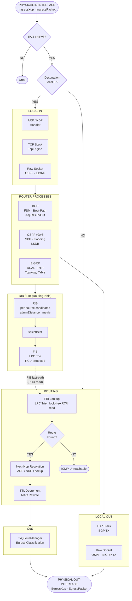

# VirtualRouter — Architecture

This document explains *why* the system is built the way it is. It does not
describe what files exist or list class members — the code does that. Each
section answers the question: "why was this done this way, and what would
break if it were done differently?"

---

## Table of Contents

- [Design Philosophy](#design-philosophy)
1. [Repository Layout](#1-repository-layout)
2. [High-Level Architecture](#2-high-level-architecture)
3. [Global Routing & VRF](#3-global-routing--vrf)
4. [RIB / FIB / RouteWatcher System](#4-rib--fib--routewatcher-system)
5. [BGP](#5-bgp)
6. [OSPF](#6-ospf)
7. [EIGRP](#7-eigrp)
8. [Async Control Plane — ProcessQueue & ControlScheduler](#8-async-control-plane--processqueue--controlscheduler)
9. [TimeManager](#9-timemanager)
10. [Configuration Registry](#10-configuration-registry)
11. [CLI Engine](#11-cli-engine)
12. [TCP Transport Layer](#12-tcp-transport-layer)
13. [Hardware — Ingress & Egress Pipelines](#13-hardware--ingress--egress-pipelines)
14. [Infrastructure — ARP & NDP](#14-infrastructure--arp--ndp)
15. [Interface Layer](#15-interface-layer)
16. [QoS](#16-qos)
17. [Cross-Cutting Decisions](#17-cross-cutting-decisions)
18. [Concurrency Model](#18-concurrency-model)

---

## Design Philosophy

A few core convictions shaped every decision in this codebase. They're worth stating
explicitly because they explain choices that might otherwise look like over-engineering.

**The data plane must never yield to the control plane.**

Packet forwarding happens on nanosecond timescales. Route updates, SPF runs, and BGP
best-path recalculations happen on millisecond timescales. These two worlds should
never block each other.

The FIB is protected by RCU — a forwarding thread takes one memory barrier and
proceeds without lock acquisition, ever. The control plane publishes a new FIB entry
atomically and retires the old one after all readers have drained. A BGP convergence
event, an OSPF SPF run, or an EIGRP diffusing computation has zero impact on
forwarding throughput. The hardware RX threads don't even know the control plane
exists; they just do a FIB lookup and hand the packet to egress.

This isn't a performance optimization applied after the fact — it's the foundational
constraint the entire threading model is built around.

**Abstractions should cost nothing at runtime.**

C++ templates are used not as a convenience but as a correctness and performance
tool. The CLI parser generates its match logic at compile time via fold expressions
— at runtime it is a straight sequence of string comparisons with no hash table and
no dynamic dispatch. The config registry resolves field access by type tag at compile
time — no string lookup, no map, no runtime branching at config read sites. The BGP
address family system specializes `AddressFamilyInstance<N>` at compile time for each
AFI/SAFI — the IPv4 and IPv6 code paths are fully separate, with no `if (af == IPv6)`
branches in the hot path.

The rule of thumb: if something can be decided at compile time, it is. If it can't,
the runtime cost should be explicit and measurable.

**Type safety is a design tool, not just a feature.**

The config registry makes it impossible to read a field from the wrong registry scope
— the compiler rejects it. The CLI command system makes it impossible to have an
unhandled command at runtime — if a mode has no registered parser, it's a compile
error. The BGP address family variant ensures that every visit site handles every
enabled AFI/SAFI — an incomplete `std::visit` lambda is a compile error. OSPF LSA
bodies are `std::variant`, so pattern-matching over LSA types is exhaustive by
construction.

These aren't conveniences. They prevent entire categories of bugs that would
otherwise be silent runtime failures — wrong config key, wrong address family,
unhandled LSA type. The type system enforces protocol invariants that the RFC states
in English.

**Protocol state is single-threaded; threading is structural.**

Instead of protecting protocol data structures with mutexes, each protocol process
serializes all mutations through a `ProcessQueue` — a lock-free MPSC ring. Hardware
threads, the TCP engine, and the timer subsystem all produce events onto this queue;
a ThreadPool worker drains it one event at a time. Protocol code never needs to worry
about concurrent access to its own state because by construction it only ever runs on
one thread at a time.

Locks exist only at the narrow boundaries where the outside world touches shared
mutable state: the VRF interface list, the ARP/NDP neighbor tables. Everywhere else,
the threading model makes locks unnecessary. This is not "avoid locks because they're
slow" — it's "structure the system so that locks are the wrong tool for most of the
problem."

**RFC compliance is the specification.**

Each protocol implements the actual standard, not an approximation. OSPFv2 implements
all 8 neighbor states, the exact DR/BDR two-pass election from RFC 2328 §9.4,
sequence number rollover, and MaxAge flooding with proper purge semantics. BGP
implements all 31 FSM events, all 11 best-path selection steps, AS4 path
reconstruction per RFC 4893 §4.2.3, and capability negotiation per the OPEN message
spec. EIGRP implements actual DUAL with the feasibility condition as specified — not a
simplified variant.

The goal is a router that can form adjacencies with real Cisco, Juniper, and FRR
instances and behave correctly without special casing. That requires reading the RFC
carefully enough to get the corner cases right, not just the happy path.

**VRF isolation is a first-class constraint, not a retrofit.**

`VirtualRouter` is the root of all protocol state from day one. Each VRF has its own
RIB, its own FIB, its own TCP stack, its own OSPF and BGP processes. There is no
global protocol state. This is not a multi-tenancy feature added later — it's the
base assumption the ownership model is built on. Adding a second VRF is adding a
second `VirtualRouter`. Nothing else changes.

---

## 1. Repository Layout

The directory structure encodes coupling constraints, not just organization. Code
in `hardware/` depends on kernel AF_PACKET and AF_XDP APIs and must not know that
protocols exist. Code in `routing/` depends on VRF state and must not know which
kernel I/O backend is running. Neither layer can accidentally reach the other because
they live in separate trees with no cross-includes in those directions.

The separation makes the layering auditable. If `routing/bgp/` ever included anything
from `hardware/`, that would immediately signal a design violation. The directory
layout is the first line of enforcement for the layered architecture described in §2.

```
VirtualRouter/src/
│
├── core/                       Per-VRF system objects: VirtualRouter, RoutingTable
│   └── routing/                RIB, FIB, RouteWatcher, RibBucket
│
├── routing/
│   ├── bgp/                    Full RFC 4271 BGP implementation
│   │   ├── af/                 AddressFamily template system + per-AF instance
│   │   ├── decision/           BestPath comparator + DecisionEngine
│   │   ├── neighbor/           Neighbor, NeighborAf, NeighborTable
│   │   ├── rib/                LocRib, AttributeManager, RibTypes
│   │   ├── session/            Session, Fsm, SessionTimers, ProcessQueue, Capabilities
│   │   └── transport/          Transmission (BgpRx, BgpTx)
│   │
│   ├── ospf/                   OSPFv2 + OSPFv3 implementation
│   │   ├── area/               Area management and inter-area logic
│   │   ├── interface/          OSPF interface state machine
│   │   ├── lsa/                Per-LSA-type headers + bodies (v2 and v3 variants)
│   │   ├── lsdb/               Link-State Database with pmr optimization
│   │   ├── rib/                OSPF RIB + route types
│   │   ├── topology/           SPF computation and route path types
│   │   └── transmission/       OSPF wire format encode/decode
│   │
│   └── eigrp/                  EIGRP classic + named mode
│       ├── rtp/                Reliable Transport Protocol + Neighbor state machine
│       ├── topology/           Topology table and metric types
│       └── interface/          Interface manager
│
├── cli/
│   ├── parser/                 Command<>, CliModeParser<>, FixedString
│   ├── modes/                  Mode enum, CliMode path table
│   │   └── contexts/           Per-mode Context objects
│   ├── execution/              Executor<> — mode switching and dispatch
│   └── runtime/                CliSession, I/O loop
│
├── configs/
│   └── registry/               RegistryDatabase<> and per-protocol registry definitions
│       └── router/             BgpRegistry, OspfRegistry, EigrpRegistry, etc.
│
├── transport/
│   └── tcp/                    Tcp, TcpEngine, Connection, TxBuffer, Listener
│
├── hardware/
│   ├── ingress/                IngressBase, IngressXdp, IngressPacket
│   └── egress/                 EgressBase, EgressPacket, EgressSend
│
├── infrastructure/
│   ├── arp/                    ARP table + request/reply handling
│   └── ndp/                    NDP (IPv6 neighbor discovery)
│
├── interface/                  Interface abstraction (physical/loopback/SVI)
├── services/                   DHCP, DNS
├── qos/                        TxQueueManager, RxQueueManager, egress policies
├── security/                   Key management, authentication
├── utils/                      ThreadPool, TimeManager, Logger
├── processing/                 Packet processing pipeline (scaffold)
├── packet/                     Header definitions (BgpHeader, etc.)
├── types/                      IPAddress, IPPrefix, AddressFamily enum
└── web/                        REST API (minimal scaffold)
```

---

## 2. High-Level Architecture

The system is layered so that information flows in exactly one direction: hardware
reads packets, the FIB decides where they go, the RIB decides what the FIB contains,
and protocols decide what the RIB contains. No layer reaches back into the layer
below it. This one-directional flow is what makes the forwarding path lock-free: the
forwarding thread never needs to ask the control plane anything — it just reads the
FIB and acts on it.

```
┌──────────────────────────────────────────────────────────────────────────────┐
│                         CLI / Configuration Layer                            │
│     CliModeParser<> + Command<> templates  ·  RegistryDatabase<>             │
└──────────────────────────────────┬───────────────────────────────────────────┘
                                   │ config reads/writes
┌──────────────────────────────────▼───────────────────────────────────────────┐
│                        Global System Controller                               │
│  ThreadPool  ·  TimeManager  ·  ControlScheduler  ·  ARP/NDP global config   │
└──────────────────────────────────┬───────────────────────────────────────────┘
                                   │ creates/owns
┌──────────────────────────────────▼───────────────────────────────────────────┐
│                         VirtualRouter  (= VRF)                                │
│  ┌───────────────┐  ┌───────────────┐  ┌──────────────┐  ┌────────────────┐  │
│  │  BgpProcess   │  │  OspfProcess  │  │    Eigrp     │  │  RoutingTable  │  │
│  │  (per AS)     │  │  (per procId) │  │  (per AS/VRF)│  │  (RIB + FIB)  │  │
│  └───────┬───────┘  └──────┬────────┘  └──────┬───────┘  └───────┬────────┘  │
│          │                 │                   │                  │           │
│          └─────────────────┴───────────────────┴──────────────────┘          │
│                            route install / withdraw                           │
└──────────────────────────────────┬───────────────────────────────────────────┘
                                   │ FIB lookup
┌──────────────────────────────────▼───────────────────────────────────────────┐
│                       Interface Layer                                         │
│         Interface  ·  per-VRF TCP::Tcp  ·  ARP/NDP tables                    │
└──────────────────────────────────┬───────────────────────────────────────────┘
                                   │
┌──────────────────────────────────▼───────────────────────────────────────────┐
│                     Hardware I/O  (per Interface)                             │
│         IngressBase ←→ RxQueue  ·  EgressBase ←→ TxQueue                     │
│         IngressXdp (XDP fast path) or IngressPacket (kernel socket)           │
└──────────────────────────────────────────────────────────────────────────────┘
```

All protocol control-plane work (FSM transitions, route recalculation, UPDATE
generation) is serialized through per-process `ProcessQueue` instances so that
protocol threads never block hardware I/O threads.

### Packet Processing Flow



**Path legend**

| Path | Description |
|------|-------------|
| Physical In → Routing → Physical Out | Transit packet forwarding. FIB lookup is a lock-free RCU read on the LPC trie. ARP/NDP resolves the next-hop MAC. TTL is decremented and the Ethernet header is rewritten before egress. |
| Physical In → Local In → Router Processes | Control traffic destined for this router (BGP TCP/179, OSPF multicast 224.0.0.5/6, EIGRP multicast 224.0.0.10). Delivered to the TCP stack or raw socket handler, then dispatched to the owning protocol process via its `ProcessQueue`. |
| Router Processes → RIB/FIB | Protocol processes install and withdraw routes through `RoutingTable`. `selectBest` picks the winner by admin-distance then metric and atomically swaps the new `FibEntry` into the LPC trie via RCU. |
| Router Processes → Local Out → Physical Out | Control packets generated by protocol processes (BGP UPDATEs, OSPF LSAs, EIGRP Hellos). BGP sends via the TCP stack; OSPF and EIGRP write directly to raw sockets. |

---

## 3. Global Routing & VRF

`VirtualRouter` is the VRF boundary from day one — not a feature bolted on later.
The consequence is that there is no global protocol state anywhere in the system.
Each VRF has its own RIB, FIB, TCP stack, and protocol instances. Adding a second
VRF is instantiating a second `VirtualRouter`. Removing a VRF is destroying one.
Nothing else needs to change.

### Why interfaces are globally owned but VRF-attached

An interface is a hardware resource — a physical NIC exists whether or not a VRF has
claimed it. If the VRF owned the interface, moving an interface between VRFs would
require protocol teardown coordination across two VRF objects simultaneously, with
no clean point of synchronization. Instead, the VRF holds a reference, and `setVRF()`
on the Interface handles all teardown and re-attach logic in one place. The ownership
split is intentional: hardware ownership stays global, logical assignment is VRF-scoped.

### Why protocols are fully owned by the VRF

> **Protocol teardown must be automatic on VRF destruction.**
>
> If protocol instances were globally owned and referenced by VRFs, destroying a VRF
> would require the caller to know which protocols existed and call teardown on each —
> a fragile ordering requirement that any new protocol addition could break.
>
> Full ownership by the VRF means `~VirtualRouter()` destroys everything in a defined
> order without any external coordination. No protocol can outlive its VRF.

**Router ID calculation** (`calculateRID`): Scans the interface list for the highest
IPv4 address on a loopback; if none found, falls back to the highest IPv4 on any
Ethernet interface. This mirrors Cisco IOS RID election behavior and ensures
deterministic IDs on stable topologies without manual configuration.

---

## 4. RIB / FIB / RouteWatcher System

Three design decisions define this subsystem.

### Why RIB is template-parameterized over address family

> **Why `Rib<AddrType>`, not a single table with runtime AF flags.**
>
> A single table with `if (af == IPv6)` scattered through every route operation
> would make it impossible for the compiler to reason about type correctness across
> address families. Any new AF would require auditing every conditional. The cost
> is latent bugs where IPv4 logic silently runs on an IPv6 prefix.
>
> `Rib<uint32_t>` and `Rib<__uint128_t>` are generated as completely separate,
> type-safe instances. The compiler rejects any cross-AF operation at the call site.
> There is no runtime AF branching anywhere in the hot path.

### Why RCU for the FIB

> **Why RCU, not a shared mutex on the FIB.**
>
> The FIB is read on every forwarded packet — nanosecond-scale accesses. Even an
> uncontended mutex costs hundreds of nanoseconds for the acquire/release pair, plus
> it serializes all forwarding threads behind the same lock.
>
> RCU makes the read completely lock-free: a forwarding thread takes one memory
> barrier, does its lookup, and exits the guard. The writer pays the cost: it copies
> the new entry to the heap, atomically swaps it in, and defers freeing the old one
> until all current readers have exited their guards. For a data structure read on
> every packet but written only on route convergence, this is the right trade.

### Why RouteWatcher instead of polling

> **Why callback-based NHT, not polling for next-hop reachability.**
>
> Polling would waste CPU continuously and introduce reaction latency proportional
> to the poll interval. For BGP next-hop tracking, a 1-second poll interval means
> routes with unreachable next-hops are advertised for up to 1 second after the
> route withdraws. For redistribution, the same delay applies.
>
> `RouteWatcher` fires callbacks immediately when the relevant prefix changes, from
> the RIB's scheduler thread. Reaction latency is one scheduler quantum. The protocol
> doesn't poll — it's told.

### Three Watch Modes

**Exact prefix watch** (`watchRoute`): Fires whenever the best route for a specific
(prefix, length) changes according to a filter. Used for redistribution: "tell me
whenever OSPF changes its best route for 10.0.0.0/8."

**LPM address watch** (`watchAddress`): Watches reachability of a host address via
longest-prefix match. This is BGP NHT. When the covering prefix withdraws, the watch
automatically re-pins to the next less-specific prefix — the caller transparently
follows route changes through supernet fallbacks without re-registering.

**Per-source protocol watch** (`watchProtocol`): Fires whenever any best route from
a specific `(RouteSource, processId)` pair changes. Designed for redistribution where
the consumer cares about one protocol's entire contribution to the RIB.

**Return value convention**: Callbacks return `bool`. Returning `true` means
"I'm done — unsubscribe me." Returning `false` keeps the watch alive.

### RibBucket and FIB consistency

Each unique (prefix, length) pair owns one `RibBucket` holding all competing source
routes. `selectBest()` runs after every add/remove: it saves the previous winner,
scans all sources comparing admin-distance then metric, deep-copies the winner to a
new heap `FibEntry`, atomically swaps it into the RCU-protected FIB pointer, and
retires the old copy. This ensures FIB readers are never exposed to a pointer into
the potentially-reallocating routes vector.

### BGP Next-Hop Tracking (NHT)

BGP NHT is implemented using `watchAddress`. The NHT callback fires on the RIB's
scheduler thread. Because BGP state must only be mutated from the BGP scheduler
thread, the callback immediately posts back to the BGP process queue before touching
any BGP state. A configurable trigger delay (`BGP_NEXT_HOP_TRIGGER_DELAY`) batches
multiple NHT changes behind a timer, preventing thrashing when a link flap affects
many prefixes simultaneously.

---

## 5. BGP

BGP implements RFC 4271 with RFC 4893 (4-byte AS), RFC 2918 (route refresh),
RFC 4724 (graceful restart framework), and MP-BGP (RFC 4760). The design is
structured around two ideas: the FSM is the ground truth for session state, and
per-AFI logic is expressed as compile-time policy rather than runtime branching.

### Why the session carries no knowledge of address families

A BGP session only drives the FSM and delivers parsed messages. Address family
instances consume those messages independently and install routes through a shared
`RoutingTable` reference. This separation means adding a new AFI/SAFI requires no
changes to the session or FSM code — only a new policy type and a new instantiation.
The alternative — a session class with AF-specific branches — would make every FSM
transition site aware of every AF it might be carrying, and every new AF would
require auditing those sites.

### Address Family Template System

All per-AFI logic (NLRI encoding, route table types, wire format) is a compile-time
policy type. `AddressFamilyInstance<N>` is specialized separately for IPv4 unicast,
IPv6 unicast, VPNv4, VPNv6. Each specialization is a fully separate compiled
instance with no dead branches for AFIs that aren't active. Adding a new AFI means
defining a new NLRI policy struct and adding it to the variant — no existing code
changes.

`AddressFamilyVariant` is a `std::variant` of all possible instantiations. `std::visit`
is used when you need to operate on all enabled AFs uniformly at runtime. The
compiler enforces that every `std::visit` handles every variant member — a missing
case for a new AFI is a compile error, not a runtime crash.

### FSM (Fsm.cpp)

The FSM implements RFC 4271 §8 exactly. States:

```
IDLE → CONNECT → ACTIVE → OPEN_SENT → OPEN_CONFIRMED → ESTABLISHED
         ↑___________________________|
         (TCP failure at any active state → back to IDLE or ACTIVE)
```

Additional events beyond RFC 4271:
- `ROUTE_REFRESH` (RFC 2918)
- `BFD_DOWN / BFD_UP` (framework hooks)
- `MAX_PREFIX_REACHED` (prefix limit enforcement)

On `OPEN_RECEIVED`, the FSM validates:
- BGP version (must be 4)
- Hold time (must meet `MINIMUM_HOLDTIME` config)
- AS number matching (eBGP: must match configured peer ASN)
- Capability negotiation (OPEN parameters → `NegotiatedCapabilities`)

Collision detection is handled by comparing Router IDs; the higher-RID session wins
and the lower is sent `CEASE` notification.

### Inbound Route Processing Pipeline

```
onParsedUpdateFromPeer(Neighbor&, ParsedUpdate<Nlri>)
    │
    ├─ For each announced prefix:
    │   ├─ applyIngressPolicy(route) → bool (true = DROP)
    │   │   ├─ AS_PATH loop detection
    │   │   ├─ ALLOWAS_IN / ALLOWAS_IN_OCCURANCES counting
    │   │   └─ Route policy filter
    │   │
    │   ├─ Insert into adjRibIn[neighborId][prefix]
    │   ├─ MAXIMUM_PREFIX check → post MAX_PREFIX_REACHED if exceeded
    │   └─ Queue recomputeNlri(prefix)
    │
    └─ For each withdrawn prefix:
        ├─ Remove from adjRibIn
        └─ Queue recomputeNlri(prefix)

recomputeNlri(prefix)
    │
    ├─ Collect all candidates: adjRibIn[*][prefix] + networkLocalRoutes
    ├─ DecisionEngine::selectBest(candidates) → optional<LocalRoute<N>>
    │
    ├─ If winner changed:
    │   ├─ locRib.installOrReplace(prefix, winner)
    │   ├─ installToRibDirect(prefix, winner)  ← into global RIB
    │   └─ recomputeAdjRibOut(prefix, winner)
    │
    └─ If no winner: withdraw from locRib + global RIB
```

### Decision Engine

`DecisionEngine` wraps `BestPathComparator` and implements the 11-step RFC 4271
best-path algorithm plus extensions:

```
Step  0: WEIGHT (higher wins) — Cisco extension
Step  1: LOCAL_PREF (higher wins)
Step  2: Locally originated (prefer over received)
Step  3: AS_PATH length (shorter wins)
Step  4: Origin code (IGP=0 < EGP=1 < Incomplete=2)
Step  5: MED (lower wins; medMissingAsWorst config option)
Step  6: eBGP > iBGP
Step  7: IGP metric to next-hop (lower wins; ignoreIgpMetric config option)
Step  8: Oldest eBGP route (prefer established session) OR compare Router ID
         (compareRouterId config option controls this)
Step  9: Router ID (lower wins; used as deterministic tiebreaker)
Step 10: Cluster List length (for route reflectors; shorter wins)
Step 11: Peer IP address (lowest wins; final deterministic tiebreaker)
```

### Why AttributeManager uses flyweight refcounting

In a full BGP table, many routes share identical AS-PATHs and community sets.
Storing a full copy per route would make the table several times larger than
necessary, and updating a shared attribute (e.g., prepending your own AS on egress)
would require finding and rewriting every route that referenced it. `AttributeManager`
deduplicates by content hash. Routes store only a `uint32_t pathId`. `RouteBase`
RAII wraps retain/release so that reference counts are automatically maintained
through copy/move/destroy. No route can outlive its attributes; no attribute set is
freed while a route still references it.

---

## 6. OSPF

OSPF implements RFC 2328 (OSPFv2) and RFC 5340 (OSPFv3) as a single dual-stack
implementation. The central decision is that OSPFv2 and OSPFv3 share one SPF engine
and one neighbor state machine, parameterized by a `PolicyV2` / `PolicyV3` template
argument that supplies the wire format differences. This avoids duplicating the
algorithmic core while keeping the protocol-specific encoding details entirely
separate.

### Why LSA bodies are `std::variant` instead of virtual classes

> **Why `std::variant<RouterLsa, NetworkLsa, ...>`, not `virtual LsaBody`.**
>
> The LSDB can contain thousands of LSAs. A vtable pointer per LSA is 8 bytes of
> overhead per entry plus a heap allocation per LSA body. For a large topology this
> is measurable. More importantly, `std::visit` over a variant is exhaustive — the
> compiler enforces that every SPF code path handles every LSA type. A missing case
> is a compile error.
>
> Virtual dispatch would leave a missing LSA handler as a runtime crash or silent
> wrong behavior. The variant approach eliminates that class of bug entirely.

### SPF Computation

SPF is Dijkstra's algorithm run on the LSDB. The result feeds into `OspfRib` which
installs routes into the VRF's global `RoutingTable`.

The `OSPF_LSDB_USE_PMR=1` flag enables `std::pmr` arena allocation for LSA storage
during SPF computation, reducing allocator overhead for large LSDBs. The tradeoff
is that pmr arenas are bulk-freed — appropriate for SPF's "compute then discard"
access pattern, not for persistent structures.

### Neighbor State Machine

The neighbor FSM mirrors RFC 2328 §10 exactly:

```
DOWN → ATTEMPT → INIT → 2WAY → EXSTART → EXCHANGE → LOADING → FULL
```

Key transitions:
- **INIT**: Hello received; router ID and options validated; DR/BDR election triggered
- **2WAY**: Bidirectional communication confirmed; decision whether to form adjacency
- **EXSTART**: Master/slave negotiation; DBD sequence initialized
- **EXCHANGE**: DBD packets exchanged; LSR list built from `compareLSASummary`
- **LOADING**: LSU/LSAck retransmit in progress; LSR retransmit timer active
- **FULL**: Adjacency complete; Router/Network LSA (re)originated

On neighbor **DOWN**: LSU/LSR retransmit lists cleared; all LSAs from that router are
MaxAge-flooded via `area.flushNeighborLsas(rid)`.

DR/BDR election uses the full RFC 2328 §9.4 two-pass algorithm. After election,
EXSTART is triggered for affected neighbors and the originator updates the Router LSA.

### OSPFv3 dual-stack structure

OSPFv3 wraps two `OspfProcess` instances (one IPv4, one IPv6 AF) under a single
`OspfV3Instance`. Area 0 (backbone) is treated specially for ABR logic. This mirrors
the RFC 5340 model where OSPFv3 is address-family-agnostic at the protocol level and
the same instance can carry both AF prefixes.

---

## 7. EIGRP

EIGRP's most interesting design problem is DUAL — the Diffusing Update Algorithm.
Unlike distance-vector protocols that are prone to count-to-infinity, and unlike
link-state protocols that require full topology knowledge, DUAL achieves loop-free
convergence with only neighbor-local information by enforcing the feasibility
condition. Getting DUAL right requires careful implementation of the active/passive
state machine, the SIA timer escalation, and per-neighbor query tracking. That's
where the implementation complexity lives.

Classic mode and named mode share the same `Eigrp` implementation object. The only
difference is how configuration is structured at the CLI level, which is resolved
before it reaches the protocol code.

### DUAL Algorithm — Feasibility Condition

The feasibility condition is fully implemented:

```cpp
route.isFeasibleSuccessor = (route.routeInfo.reportedDistance < bestFD);
```

A neighbor's route is a Feasible Successor if and only if its Reported Distance is
strictly less than this router's current Feasible Distance. This guarantees the backup
route is loop-free without requiring a full SPF run — it's the core insight of DUAL.

### Active/Passive State Machine

```
PASSIVE (normal state, successors exist)
    │
    │  successor lost, no feasible successor available
    ▼
ACTIVE (diffusing computation underway)
    │  ├─ Send QUERY to all neighbors (except route origin)
    │  ├─ Start SIA timer
    │  └─ Track replies via OutgoingQuery / pending queries map
    │
    │  all replies received (concludeActive)
    ▼
PASSIVE (new successor installed, FD updated)

POISONED (route being withdrawn)
    │  holdtime expires
    ▼
removed from topology table
```

### SIA (Stuck-In-Active) Handling

After `MAX_SIA_RETRIES` retransmissions without a reply, a SIA-QUERY is sent. If that
also times out, `handleSIATimeout()` tears down the non-responding neighbor. This
prevents the topology from being permanently stuck if a neighbor becomes unreachable
mid-query — the RFC mandates this escalation to protect the remaining topology.

### Why RTP instead of TCP for control messages

> **Why a custom Reliable Transport Protocol over UDP multicast, not TCP.**
>
> TCP is a unicast, connection-oriented protocol. EIGRP control traffic (Hellos,
> Updates, Queries, Replies) is sent to the EIGRP multicast group. Running TCP to
> each neighbor would require N separate connections for N neighbors, with N separate
> retransmit timers, N receive buffers, and N separate TCP stacks — overhead that
> scales with neighbor count.
>
> RTP provides reliable ordered delivery per-neighbor over the existing UDP multicast
> path. It's lighter than TCP: per-neighbor sequence tracking, exponential backoff,
> and Jacobson/Karels RTT estimation are sufficient for EIGRP's reliability
> requirements. Not all packets need reliability (Hellos are best-effort) — RTP
> delivers reliable delivery only where the protocol requires it.

**Sequence tracking**: Per-neighbor `lastSeqRecv`, `sentInitSeq`, `recvInitSeq`.
Sequence number 0 is reserved for unreliable packets. Wrap-around at `uint32_t::max`
wraps to 1, not 0.

**RTO computation** (TCP-style Jacobson/Karels):
```
srtt   = (1-1/8)*srtt   + (1/8)*sample
rttvar = (1-1/4)*rttvar + (1/4)*|sample - srtt|
rto    = clamp(srtt + 4*rttvar, 1s, 60s)
```

After `MAX_RETRANSMISSIONS = 16` exhausted → neighbor declared DOWN.

### Neighbor State Machine

```
DOWN ──hello received──► PENDING ──init exchange complete──► UP
  ▲                          │                                │
  └──hold timer expires───────┘       hold timer expires ─────┘
  └──retransmit exhausted─────────────────────────────────────┘
```

K-value validation happens at PENDING — mismatched K-values reject the neighbor
before any state is allocated. Only after both sides have acked the init exchange
does `sendFullTopology()` transmit the complete topology to the new neighbor.

### Composite Metric Engine

Full K-value composite metric formula with 128-bit intermediate precision:

```
scaledBW   = (10,000,000 × 65,536) / interfaceBandwidth
scaledDelay = (delay_picoseconds / 1,000,000) × 65,536

base = K1×scaledBW + K3×scaledDelay
if K2 != 0: base += K2×scaledBW / (256 - load)
if K5 != 0: base = base × K5 / (K4 + reliability)
```

Default: K1=1, K2=0, K3=1, K4=0, K5=0 → classic bandwidth+delay formula.

Split horizon is the default and prevents routing loops by not advertising a route
back on the interface it was learned from. It can be disabled per-interface when
hub-and-spoke topologies require full routing knowledge at spokes.

---

## 8. Async Control Plane — ProcessQueue & ControlScheduler

Protocol state machine work is serialized through per-process lock-free queues.

### Why ProcessQueue instead of mutexes on protocol state

Fine-grained locking produces lock ordering requirements that are easy to violate,
creates heisenbugs that only reproduce under specific thread scheduling variations,
and requires every protocol function to reason about which locks it holds and which
it needs to acquire. Serializing through a queue eliminates that entire problem class:
protocol code never needs a lock because by construction it only ever executes on
one thread at a time.

The queue is lock-free (MPSC sequence CAS) so that hardware RX threads and the timer
thread can post events to protocol queues without contending with each other or with
the consumer.

### Why sub-queues (lanes)

A single MPSC queue would serialize all event types behind each other. If a large
batch of RX events floods the queue, TIMER events would be starved. BGP uses separate
lanes for TIMERS, RX, and NOTIFICATIONS. Within each lane, events are strictly ordered.
Events across lanes are interleaved by the scheduler based on availability — a TIMER
event is never stuck behind a large RX batch.

### Enqueue path (lock-free CAS loop)

```
producer:
  head = queue.head.fetch_add(1)     ← atomic claim of slot
  slot = &slots[head % capacity]
  while slot.seq != head: _mm_pause() ← wait for previous producer to finish
  slot.task = fn
  slot.seq.store(head + 1)           ← publish to consumer
```

No mutex. Multiple producers claim different slots atomically and fill them
independently. The consumer sees them in sequence-number order regardless of
which producer finished writing first.

### ProcessQueueRef teardown

`ProcessQueueRef::release()` marks the queue closed and spins until all in-flight
callbacks have completed. After `release()` returns, no more callbacks will execute
from this ref, and the owning object is safe to destroy. This is the one safe
teardown path — it prevents use-after-free when a protocol process is removed
while timer callbacks are still queued.

### ThreadPool

Global worker thread pool. Workers continuously drain `ProcessQueue` sub-queues.
`ThreadPool::Task` uses Small Object Optimization — 128 bytes of inline storage
covers any lambda that captures up to ~12 pointers. No heap allocation per task.

---

## 9. TimeManager

Protocol timers must fire accurately, but they must not execute protocol logic
directly on the timer thread.

### Why timers post to ProcessQueue rather than calling protocol code directly

If the timer thread called into protocol state machines, it would create a second
execution context for those machines alongside the ProcessQueue consumer, requiring
locks on all protocol state — the exact problem the ProcessQueue design was built
to avoid. Instead, the timer thread posts tasks onto the target `ProcessQueue` and
returns immediately. Protocol code executes only on the ThreadPool, regardless of
what triggered it.

If a timer fires after cancellation is requested but before the cancel takes effect,
the callback detects the generation mismatch and exits without executing. No protocol
state is ever touched from the timer thread.

`TimeManager` provides:
- **One-shot timers**: fire once at absolute expiration time
- **Recurring timers**: automatically reschedule after each fire
- **Cancellation**: O(1) cancel by timer ID

---

## 10. Configuration Registry

The configuration system uses C++ type tags as config keys. There are no runtime
string lookups, no `map<string, variant>`, and no possibility of a typo producing a
silently wrong default. A config read site that uses the wrong key is a compile error.
A config read site that accesses a key from the wrong registry scope is a compile error.

### Why type-tag keys rather than string keys

In a string-keyed system, a typo in a config read site compiles and runs, producing
either the wrong default (if the key was never set) or the wrong protocol behavior
(if another key happened to share the typo's spelling). Neither is detectable without
knowing the expected value.

With type-tag keys, the compiler rejects any key not defined in the relevant registry.
The compiler rejects accessing a BGP key from an OSPF registry scope. The downside is
ceremony: adding a config field requires a type definition. For a router, this is the
right trade — config key typos in production protocol code are silent, persistent bugs.

### How fields are accessed

```cpp
// Optional field:
auto rid = proc.getConfigs().get<Config::Bgp::BGP_ROUTER_ID>();
if (rid.hasValue()) return rid.load();

// Required field:
bool gr = procCfg.get<Config::Bgp::BGP_GRACEFUL_RESTART>().load();
```

`get<Tag>()` returns a `ConfigField<T>` wrapper. The compiler resolves the correct
registry and field at compile time — no hash lookup, no string comparison.

### Registry Hierarchy

```
Global Registry
├── BgpRegistry                     (process-level BGP settings)
│   ├── BGP_ROUTER_ID
│   ├── BGP_AS_NUMBER
│   ├── BGP_GRACEFUL_RESTART
│   └── ...
│
├── BgpNeighborSessionRegistry      (per-neighbor session settings)
│   ├── BGP_NEIGHBOR_REMOTE_AS
│   ├── KEEPALIVE_INTERVAL
│   ├── MINIMUM_HOLDTIME
│   └── ...
│
├── BgpAfBaseRegistry               (per-AF, per-neighbor settings)
│   ├── ACTIVATE
│   ├── SEND_COMMUNITY
│   ├── MAXIMUM_PREFIX / WARNING_ONLY
│   └── ...
│
├── OspfRegistry                    (process-level OSPF)
├── OspfAreaRegistry                (per-area settings)
├── OspfInterfaceRegistry           (per-interface OSPF settings)
└── ...
```

`Config::Reference<RegistryType>` is a lightweight non-owning reference to a registry
scope. Each protocol process holds one and uses it to read its own configuration
without needing to know about other registries.

### OwnedListField and live notification

Fields that own keyed child registries (`OwnedListField<T, K, H>`) can carry an
optional `ApplyFn` callback. When a child is inserted or removed, the applier fires
immediately, allowing the owning protocol to react to structural changes (e.g.,
a new neighbor added in config triggers session setup) without requiring the CLI
layer to know anything about protocol internals.

---

## 11. CLI Engine

The CLI is a fully compile-time command parser. There are no runtime command
registration tables, no function pointer maps, and no `strcmp` on command tokens.
Commands are types.

### Why commands are types rather than registered callbacks

In a runtime registration table, a command can be defined but never registered, or
registered under the wrong name, or unregistered without updating related code. None
of these are detectable at compile time. In the template system, the command IS its
own parser — there is no separate registration step. Adding a command means adding
one type and including it in the parser list. Removing it means deleting it. The
compiler enforces completeness: if a `CliModeParser` is instantiated with a command
that doesn't define the required static `tryExecute` method, it's a compile error.

### Command<Handler, Parts...>

A `Command` captures the full pattern of one CLI command at compile time. Fixed tokens
must match exactly by precomputed hash. `ARG` matches any pattern token and captures
it. The match logic is generated at compile time — no runtime dispatch table, no
hash map of commands.

`CliModeParser<Mode, Context, Commands...>` groups commands under one CLI mode.
`execute(ctx, tokens)` folds over the `Commands...` pack, trying each until one
matches. At runtime this is a linear chain of function calls with no virtual dispatch.

### Executor and mode switching

`Executor` manages mode switching using a two-slot ping-pong buffer. `changeMode<M>`
builds the new context in the inactive slot, then swaps the active index. Mode
switching is O(1) with no heap allocation. `revert()` swaps back to the previous
slot with no cleanup needed — the previous context is still valid in its slot.

`FindParser<M>` is a compile-time lookup that produces a hard compile error if no
parser is registered for a requested mode. It is impossible to enter a CLI mode that
has no handler.

### The `negate` and `defaulted` flags

Rather than duplicating every command into a `no`-form and a `default`-form variant,
the tokenizer detects the `no` and `default` keywords and sets flags on `ContextBase`.
Command handlers check `ctx.negate` and `ctx.defaulted` to decide whether to apply
or remove a configuration value. This halves the number of command definitions and
ensures that the positive and negative forms of every command are always in sync.

---

## 12. TCP Transport Layer

Each `VirtualRouter` owns an isolated `TCP::Tcp` instance.

### Why per-VRF TCP stacks rather than a shared stack

A shared TCP stack with per-VRF socket namespaces would require kernel namespace
management, leak connection state between VRFs on failure paths, and make VRF teardown
complex: the teardown code would need to know which connections belonged to which VRF
and close them in order. With isolated stacks, VRF destruction automatically closes all
its TCP connections. BGP processes in different VRFs cannot accidentally share sockets.
Multi-tenant scenarios are naturally correct.

### Zero-copy write path

`reserveSpan()` returns a writable view into the next available region of `TxBuffer`.
The caller fills the span in-place, then calls `flush()`. No intermediate copy.
`BgpTx` serializes BGP messages this way — it reserves space, writes the message
directly, then commits. For a protocol that can generate large UPDATE batches, this
is the difference between one copy per message and zero copies.

### TxBuffer design

A linked ring of blocks supporting `reserveSpan`, `commit`, `peek`, `consume`, and
`spliceFrom`. The linked-block design avoids a single large circular buffer — blocks
can vary in size, and `spliceFrom` enables O(1) composition of multiple protocol
messages for zero-copy scatter-gather sends.

### Callback integration

BGP registers three `noexcept` static callbacks with the TCP engine. They receive a
`ConnCallbackCtx` with a `void* user` field pointing to the `BgpProcess`, then enqueue
FSM events onto the BGP scheduler. The TCP thread never calls protocol logic directly
— it only enqueues work. This keeps TCP thread latency bounded regardless of protocol
computation time.

---

## 13. Hardware — Ingress & Egress Pipelines

The hardware layer's design principle is that the routing code above it must never
know which backend is running. Two ingress backends (`IngressXdp` via AF_XDP, and
`IngressPacket` via TPACKET_V3) and two egress backends (`EgressPacket` via TPACKET_V2,
and `EgressSend` via plain `sendto`) all present the same interface. The factory tries
the high-performance backend first and falls back silently. The result is that the same
routing code runs correctly on a machine with full AF_XDP support or on a basic VM with
minimal kernel capabilities.

| Layer   | Fast backend              | Fallback backend              |
|---------|---------------------------|-------------------------------|
| Ingress | `IngressXdp` (AF_XDP)     | `IngressPacket` (TPACKET_V3)  |
| Egress  | `EgressPacket` (TPACKET_V2 mmap ring) | `EgressSend` (AF_PACKET sendto) |

### Ingress

`IngressBase` owns one RX thread per NIC queue. The thread polls frames, delivers each
to `Interface::processIngress`, and batches frame returns to minimize ring update
overhead. A batch of return calls is flushed to the kernel in a single store rather
than one per frame.

`IngressXdp` (AF_XDP, XSK) delivers frames directly into a user-allocated UMEM region
— no copy between NIC and user space. It binds with `XDP_ZEROCOPY` first and falls
back to copy mode. The `XDP_RING_NEED_WAKEUP` flag is checked before every kick,
avoiding unnecessary syscalls when the ring isn't full.

`IngressPacket` (TPACKET_V3) uses block-based ring delivery. `PACKET_FANOUT` is
configured when `opts.fanoutGroup > 0`, enabling multiple RX queues on the same
interface to load-balance across cores.

### Egress

`EgressBase` owns the per-queue MPMC free ring tracking available frame slots (Vyukov
sequence-slot algorithm). All egress subclasses share this free ring management.

`EgressPacket` (TPACKET_V2) writes frames directly into the mmap'd region; a single
`sendto(MSG_DONTWAIT, nullptr, 0)` kicks the kernel to transmit all queued frames at
once. `PACKET_QDISC_BYPASS` bypasses the kernel qdisc to reduce latency. Reclaim uses
a scan-cursor strategy — `onAllocNudge()` scans at most 64 slots to avoid O(N) cost
on every allocation.

`EgressSend` (fallback) allocates a plain `posix_memalign`'d frame area and sends
each frame via `sendto(AF_PACKET)`. Incurs a syscall per frame and a kernel copy.
Used when `EgressPacket` construction fails.

---

## 14. Infrastructure — ARP & NDP

ARP and NDP serve the same role: given a next-hop IP address, find its MAC address
for the Ethernet header rewrite. They are kept separate from the FIB because
reachability (FIB) and L2 resolution (ARP) are logically independent — a route can
be present in the FIB but the ARP entry can be stale or missing. These are different
failure modes requiring different handling.

### Why shared_mutex rather than RCU for ARP/NDP

ARP entries are written frequently — they age, get evicted, and are refreshed on
every reply. RCU's deferred-free overhead is well-suited to very rare writes; for
ARP churn, the deferred-retire queue would grow constantly and the overhead would
exceed a simple shared_mutex. ARP lookups happen in the egress path after the FIB
lookup, not in the innermost forwarding hot path, so the extra read-path cost of a
shared lock is acceptable.

### Packet queuing on ARP miss

When a next-hop MAC is not found, the packet is queued and an ARP/NS request is sent.
On reply, the queued packets are flushed. This prevents dropping packets due to ARP
cache miss on first-use — important for TCP connections where the SYN would be lost
and retransmit latency would add hundreds of milliseconds to connection establishment.

### NDP extensions

NDP mirrors ARP for IPv6, additionally handling Router Solicitation/Advertisement for
SLAAC and Duplicate Address Detection (DAD) for link-local address assignment.

---

## 15. Interface Layer

The interface layer solves a dependency inversion problem. Protocols need to know
about interface events (address added, link up/down) to start neighbors and originate
LSAs. But `Interface` should not know that BGP, OSPF, or EIGRP exist — that would
create a circular dependency between the interface layer and the protocol layer.

### Why an event bus rather than direct protocol callbacks

The alternative — `Interface` calling protocol methods directly on state changes —
would require `Interface` to hold pointers to every protocol process that might care
about its state. Adding a new protocol or new event type would require modifying
`Interface`. The event bus inverts this: `Interface` fires typed events (`IPv4_READY`,
`IF_DOWN`, etc.) into `InterfaceManager`, and protocols subscribe at startup. `Interface`
has no knowledge of its subscribers.

`InterfaceManager::notify()` is `private` and called only by `Interface` (declared
`friend`). It copies the matching callback list before invoking callbacks, so no lock
is held during protocol code — callbacks can safely call back into `InterfaceManager`.

### Why per-protocol config lives on Interface

Per-protocol config (EIGRP hello interval, OSPF cost, passive mode) lives on `Interface`
rather than in the protocol's interface manager. The alternative — storing interface
configuration in the protocol layer — would require two lookups to answer "what is the
OSPF cost of interface X?": first find the interface, then find its OSPF configuration
in the OSPF process. Co-locating the config with the thing it describes means one
lookup. Protocols access it via `getEigrpConfig(as)` and `getOspfConfig()`, which
lazily allocate `config::Reference` blocks on first access.

### VRF reassignment

`setVRF()` on `Interface` is the single point that handles the interface reassignment
sequence: tears down ARP/NDP/DHCP, removes the interface from the old VRF's
`InterfaceManager`, then attaches to the new one and restarts. All protocol teardown
happens through the event bus — `setVRF` fires `IF_DOWN` before detaching, triggering
neighbor teardown across all protocols without knowing which protocols are active.

---

## 16. QoS

The QoS subsystem exists to solve two problems: how to assign NIC queues to CPU cores
efficiently, and how to enqueue packets from any thread without stalling the sender.

### Why dedicated consumer threads per TX queue

If producers called `send()` directly, the TX ring buffer (mmap'd DMA region) would
thrash between cores on every enqueue, and `send()` would block when the NIC ring is
full, stalling the forwarding thread. A dedicated consumer thread per TX queue is
pinned to a specific core. The TX buffer stays hot in that core's L1/L2 cache.
Producers enqueue to the MPMC ring and move on — backpressure is absorbed by the ring,
not by the forwarding thread.

### Why the Vyukov sequence-number MPMC ring

A mutex-based queue serializes all producers behind one lock. For a forwarding
system with multiple RX threads simultaneously completing L2 rewrites and sending
to egress, that serialization point is a bottleneck. The Vyukov ring lets N producers
write into N different claimed slots simultaneously — the only contention is on the
atomic `head` increment. Producers never block each other as long as the ring isn't
full.

### The double-drain wake pattern

The `BaseQueue` consumer uses a double-drain loop to eliminate the missed-wake race:
1. Drain the queue fully.
2. Store `wakeSignal = 0` (signal intent to sleep).
3. Drain again (catch items enqueued between steps 1 and 2).
4. `futex_wait` only if `wakeSignal` is still 0.

A producer that enqueues between steps 2 and 4 stores `wakeSignal = 1`, causing
`futex_wait` to return immediately. No wake signal is ever lost without requiring a
lock. The alternative — a simple condvar — requires a mutex on every enqueue/dequeue,
which would be acquired on the forwarding critical path.

### CPU assignment policies

`TxQueueManager` supports three policies:
- `EqualShare` — each interface gets `floor(cores / interfaces)` queues.
- `Weighted` — queue count proportional to `TxIfacePolicy::weight`.
- `txCoreBias` (0–1) — fraction of cores reserved for TX in a shared pool.

`TxDistributor` routes frames across per-CPU TX queues using flow hash, round-robin,
or weighted round-robin, ensuring consistent per-flow ordering while distributing
load.

---

## 17. Cross-Cutting Decisions

### Policy-Based Compile-Time Dispatch

**Decision**: Per-AFI logic (BGP, OSPF v2/v3) is expressed as a template policy type
rather than runtime branching on address family.

**What it solves system-wide**: Any `if (afi == IPv6)` branch in a route processing
function is a maintenance hazard — every new AFI requires auditing every branch. The
policy template generates a completely separate compiled instance per AFI. Each is
complete, has no dead branches, and adding a new AFI touches no existing code.

**Cost to change**: Adding a runtime AF flag would require auditing every code site
that currently uses template specialization — BGP's entire route pipeline, OSPF's
origination templates, and the AF variant map. The migration would be large and
error-prone.

### `std::variant` for Discriminated Unions

**Decision**: OSPF LSA bodies and BGP's address family map are `std::variant`s rather
than virtual class hierarchies.

**What it solves system-wide**: Virtual dispatch requires a vtable pointer per object
(8 bytes overhead), a heap allocation per entry, and produces non-exhaustive dispatch
— a new LSA type added to the enum but missing from a `switch` compiles silently and
crashes at runtime. `std::variant` stores all types in a discriminated union, `std::visit`
is exhaustive (missing case = compile error), and there is zero per-entry overhead.

**Cost to change**: Reverting to virtual dispatch would require adding vtable overhead
to thousands of LSDB entries and removing the compiler-enforced exhaustiveness
guarantee, restoring the possibility of silent missing-case bugs.

### Flyweight Refcounting for BGP Path Attributes

**Decision**: BGP path attributes are stored once in `AttributeManager` and referenced
by `uint32_t pathId`. `RouteBase` RAII maintains refcounts automatically.

**What it solves system-wide**: In a full table with 1M routes, many routes share
identical AS-PATHs. Full per-route copies would multiply table size; any attribute
mutation (egress AS prepend) would require updating every affected route. The flyweight
ensures each unique attribute set exists once, and mutations produce new entries rather
than touching existing ones.

**Cost to change**: Removing flyweight storage would multiply memory usage by the
average number of routes sharing each attribute set — potentially 10-100x for
well-aggregated tables.

### Lock-Free Queues with Sequence Counters

**Decision**: `ProcessQueue` sub-queues, `FIFOQueue`, and the egress free ring all
use the Vyukov sequence-number algorithm rather than mutex-protected queues.

**What it solves system-wide**: A mutex-based queue serializes all producers behind
one lock. With multiple hardware RX threads posting to protocol ProcessQueues
simultaneously, a mutex would create a global serialization point for all control-plane
event delivery. The sequence-counter ring lets N producers write into N claimed slots
with only one atomic increment as the contention point.

**Cost to change**: Replacing with mutex-based queues would reintroduce per-queue lock
contention on the forwarding hot path and under hardware RX load.

### RCU for Read-Heavy FIB

**Decision**: The FIB is protected by RCU rather than any form of locking.

**What it solves system-wide**: The FIB is read on every forwarded packet. Any lock
acquisition on that path, even uncontended, adds hundreds of nanoseconds of latency.
RCU makes the read completely lock-free. The write is more complex (copy, swap,
retire), but writes are rare relative to reads.

**Cost to change**: Replacing RCU with any form of per-lookup locking would directly
increase forwarding latency on every packet and serialize forwarding threads behind
each other on the FIB lock.

### RouteWatcher Cross-Thread Safety

**Decision**: `RouteWatcher` callbacks fire on the RIB's scheduler thread. Protocols
on different schedulers must immediately `post` back to their own queue before touching
their own state.

**What it solves system-wide**: Allowing protocol code to execute directly in the
RouteWatcher callback would mean two threads could simultaneously mutate BGP state —
the BGP ProcessQueue consumer and the RIB's scheduler thread. Any shared BGP data
would need locks. The `post`-back pattern keeps protocol state single-threaded without
any BGP-level locking.

**Cost to change**: Removing the post-back requirement would require BGP (and any other
protocol using NHT) to add locks around all state that could be touched from RouteWatcher
callbacks — defeating the purpose of the ProcessQueue design.

### Compile-Time CLI Command Matching

**Decision**: CLI commands are compile-time template types, not runtime-registered
callbacks.

**What it solves system-wide**: Runtime registration allows a command to be defined but
never registered, registered under the wrong name, or registered to the wrong mode
parser. None of these are detectable without exhaustive runtime testing. In the template
system, the command IS its own parser — no registration step, no sync problem, no
possibility of a command existing but being unreachable.

**Cost to change**: Reverting to a registration table would require adding a runtime
registration mechanism, a runtime table lookup per command, and accepting that
registration correctness is not statically verified.

### Per-VRF TCP Isolation

**Decision**: Each `VirtualRouter` owns an isolated `TCP::Tcp` instance.

**What it solves system-wide**: Shared TCP with kernel namespace management is complex
and leaks connection state between VRFs on failure paths. With isolated stacks, VRF
teardown automatically closes all its connections. BGP processes in different VRFs
cannot share sockets regardless of misconfiguration.

**Cost to change**: A shared TCP stack would require per-connection VRF tagging, VRF-
aware teardown logic, and careful handling of connections that arrive on one VRF's
listener but need to be migrated if the VRF configuration changes.

### X-Macro for Mode Table

**Decision**: The CLI mode enum and path/prompt string tables are generated from a
single X-macro definition.

**What it solves system-wide**: Without an X-macro, the mode enum and the path/prompt
arrays would be defined in separate places and could drift out of sync. Adding a mode
is one line in the X-macro; the compiler catches any inconsistency between the enum
and the arrays.

**Cost to change**: Splitting mode definitions across enum and array definitions would
re-introduce the possibility of the two drifting out of sync, with the error manifesting
as a wrong prompt string rather than a compile error.

---

## 18. Concurrency Model

Three rules govern all concurrency in this system:

1. **Hardware threads never touch protocol state.** RX threads do FIB lookups (lock-free
   RCU read) and deliver packets to the TCP engine or raw socket handler. They never
   call into BGP, OSPF, or EIGRP.

2. **Protocol state changes only on ThreadPool workers draining a ProcessQueue.**
   The TCP engine, timer thread, and hardware threads are producers only — they enqueue
   events and return. Protocol code never runs concurrently with itself for a given
   process.

3. **The timer thread only enqueues work.** It never executes protocol logic directly.
   Its latency is bounded; it is never blocked by protocol computation.

Breaking any of these rules introduces a parallel execution path to protocol state
machines and immediately requires locks on all protocol state — the exact problem the
`ProcessQueue` design was built to avoid.

```
Thread Roles:
┌───────────────────────────────────────────────────────────────┐
│ Hardware RX Thread(s)   (one per Interface, IngressBase::runLoop)
│   → poll NIC, parse Ethernet
│   → FIB lookup (lock-free RCU read)
│   → for control traffic: deliver to TCP::Tcp
│   → for forwarded traffic: pass to EgressBase
│   → NEVER acquires protocol state locks
└───────────────────────────────────────────────────────────────┘
┌───────────────────────────────────────────────────────────────┐
│ TCP Engine Thread       (TcpEngine internal)
│   → manages TCP state machines
│   → when data arrives for BGP: calls onReceiveCallback (noexcept)
│   → callback enqueues FSM event → ProcessQueue  (lock-free)
│   → NEVER calls BGP Session directly
└───────────────────────────────────────────────────────────────┘
┌───────────────────────────────────────────────────────────────┐
│ ThreadPool Workers      (N threads, global pool)
│   → drain ProcessQueue SubQueues
│   → execute protocol callbacks (FSM transitions, SPF, best-path)
│   → one queue drained at a time per protocol process
│   → serialized per-process; concurrent across processes
└───────────────────────────────────────────────────────────────┘
┌───────────────────────────────────────────────────────────────┐
│ Timer Thread            (TimeManager internal)
│   → fires timer callbacks
│   → calls ProcessQueueRef::post (never protocol code directly)
│   → bounded latency; never blocked by protocol work
└───────────────────────────────────────────────────────────────┘
```

**Per-component mutexes** (not global):
- `VirtualRouter::interfaceMutex` — protects interface list
- `VirtualRouter::eigrpMutex` — protects EIGRP map
- `ARP/NDP::shared_mutex` — protects neighbor tables

**Lock-free**:
- FIB lookup (RCU guard)
- ProcessQueue enqueue (sequence CAS)
- `RibBucket::fibEntry` swap (atomic exchange + RCU retire)
- `RouteWatcher::availableIds` (AtomicStack CAS)

**Deadlock prevention**: No component takes two locks simultaneously. Protocol layers
serialize through ProcessQueue — no mutex needed for FSM state. Hardware threads
never contend with protocol threads for the same lock.

---
